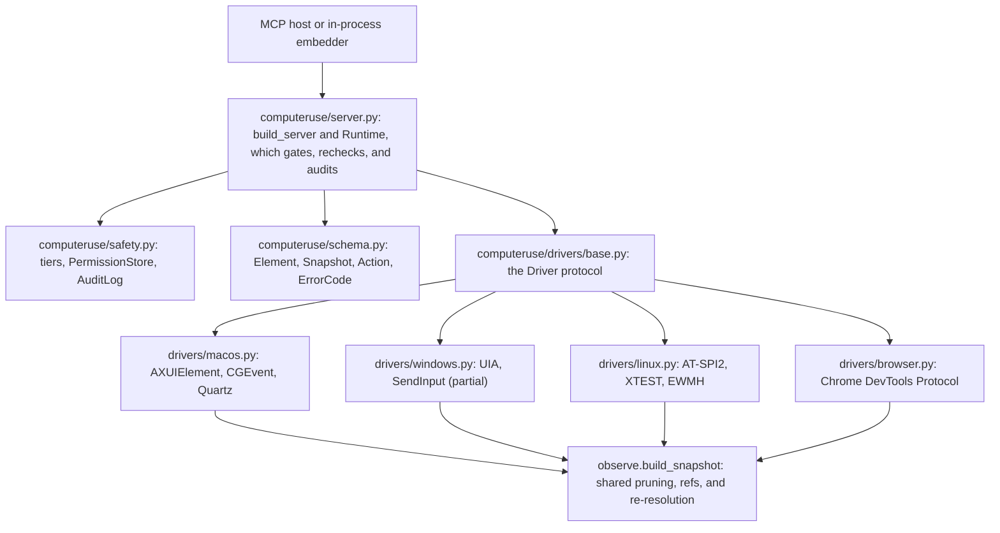

# Contributing to computerUse

computerUse is an accessibility-first computer-use framework: pruned accessibility-tree snapshots, element refs, and a safety layer, exposed as an MCP server and a CLI (paraphrasing the `description` in `pyproject.toml`). This guide covers the development setup on each platform, how the test suite and its platform gates work, what CI runs, the rule that keeps the core platform-free, how to add an MCP tool, and the conventions for commits and pull requests.

The GitHub repository is private at the time of writing. The default branch is `main`; recent work has landed on `computeruse-mvp`, and CI runs on pushes to both branches and on every pull request (`.github/workflows/ci.yml`). Read `PLAN.md` before proposing a scope change: the README's Contributing section points to it because it holds the positioning and the explicit anti-goals (section 4) and records the original architecture. Its status note at the top marks it a dated design record (front matter 2026-07-02) that has not been revised for the Windows observe/act loop or the Linux and browser backends, so take the current state from `README.md`, `CHANGELOG.md`, and the per-backend docs under `docs/`, not from `PLAN.md`.

One standing rule applies to code, docs, commit messages, and PR descriptions alike: never overclaim. Say what is implemented, say what is verified and where (a hermetic test, a CI job, a granted developer machine), and name the gate wherever something is unsupported or skipped.

## Development setup

Shared requirements:

- Python 3.11 or newer (`requires-python` in `pyproject.toml`). CI uses 3.12 on the macOS, Windows, and browser jobs; the Linux job uses the runner's distro `python3` for reasons explained below.
- The package is not published on PyPI. Install from a clone with `pip install -e`.
- `mcp` is pinned below 2.0 because `computeruse/server.py` imports `mcp.server.fastmcp`, which 2.0 removed; the 1.x line is what the suite runs on (comment in `pyproject.toml`).

Create a virtual environment with either tool. The README uses the standard library venv plus pip, with uv as the alternative; CI uses pip on every job.

```bash
git clone <repo-url> computerUse && cd computerUse

# the standard library venv (what the README shows)
python3 -m venv .venv && .venv/bin/pip install -e ".[dev]"

# or uv
uv venv && uv pip install -e ".[dev]"
```

Then add the extra for the backend you work on. The extras are defined in `pyproject.toml`.

| Backend | Install | Native prerequisites | What `ensure_trusted()` needs at runtime |
|---|---|---|---|
| macOS | `pip install -e ".[dev]"` (the pyobjc frameworks are core dependencies gated on `sys_platform == 'darwin'`) | none | the Accessibility TCC grant; Screen Recording as well for `screenshot` and `zoom`. `computeruse doctor` reports both. |
| Windows | `pip install -e ".[dev,windows]"` (adds `uiautomation`) | none | nothing: `WindowsDriver.ensure_trusted()` returns `None`, pinned in `tests/test_drivers.py` |
| Linux | see the Linux section | `at-spi2-core gir1.2-atspi-2.0 gir1.2-gtk-3.0 python3-gi xvfb dbus dbus-x11 xclip` | a reachable AT-SPI2 bus; `LinuxDriver.ensure_trusted()` raises `permission_denied_accessibility` with a fix hint otherwise |
| Browser | `pip install -e ".[dev,browser]"` (adds `websocket-client`) | a running Chromium started with `--remote-debugging-port` | a CDP endpoint with at least one page target |

### macOS

`computeruse doctor` runs six checks. The first names the app that owns the process tree, because TCC grants attach to that responsible app (your terminal or IDE) and take effect after it is relaunched:

```
[ OK ] responsible_app: TCC grants attach to Ghostty (the app bundle owning this process tree)
[FAIL] accessibility_grant: AXIsProcessTrusted() = False
       fix: Grant Accessibility to Ghostty in System Settings → Privacy & Security → Accessibility, then relaunch it. Deep link: x-apple.systempreferences:com.apple.preference.security?Privacy_Accessibility
[FAIL] screen_recording_grant: CGPreflightScreenCaptureAccess() = False
       fix: Grant Screen Recording to Ghostty in System Settings → Privacy & Security → Screen Recording, then relaunch it. Deep link: x-apple.systempreferences:com.apple.preference.security?Privacy_ScreenCapture
[ OK ] python_version: Python 3.13.0
[ OK ] pyobjc_version: pyobjc-core 12.2.1
[ OK ] mcp_import: mcp 1.28.1 imports cleanly
4/6 checks passed
```

Each `[FAIL]` line is followed by a `fix:` line naming the responsible app and a System Settings deep link (`render_text` in `computeruse/doctor.py`). `doctor` exits 0 even when checks fail.

Without the grants the package still installs and the hermetic suite passes; only the live macOS tests skip (see Running the tests).

### Linux

Two recipes work. CI uses the first: apt's `python3-gi` is built for the distro interpreter and a `setup-python` interpreter cannot import it, so the venv is created from `/usr/bin/python3` with `--system-site-packages` (so `gi` and `Atspi` resolve from apt) and the `[linux]` extra is skipped so pip never builds PyGObject from source (comments in `ci.yml`, linux job).

```bash
sudo apt-get update
sudo apt-get install -y --no-install-recommends \
  at-spi2-core gir1.2-atspi-2.0 gir1.2-gtk-3.0 python3-gi xvfb dbus dbus-x11 xclip
python3 -m venv --system-site-packages .venv
.venv/bin/pip install --upgrade pip
.venv/bin/pip install -e ".[dev]" python-xlib
```

The second is the `docs/linux-port.md` recipe written as an editable install. The `[linux]` extra pulls PyGObject and python-xlib from pip; apt provides the AT-SPI2 typelib and the bus.

```bash
pip install -e ".[dev,linux]"
sudo apt install gir1.2-atspi-2.0 at-spi2-core
```

For the clipboard install one of `xclip`, `xsel`, or `wl-clipboard`; headless machines add `xvfb` (`docs/linux-port.md`). On native Wayland (`WAYLAND_DISPLAY` set and no `DISPLAY`) coordinate clicks, drags, wheel scrolls, and key chords raise a structured `unsupported` error whose hint points at ref-based actions; press and explicit `set_value` go through AT-SPI; implicit typing requires a verified frontmost app owner (`_on_wayland` and `_wayland_input_error` in `computeruse/drivers/linux.py`). The Linux CI job runs under Xvfb, so the Wayland branches have no CI coverage.

### Browser (Chromium over CDP)

The browser backend is never selected by platform; it is selected by name through `COMPUTERUSE_DRIVER=browser` or `get_driver("browser")`. Start a Chromium that exposes DevTools, then point the server at it:

```bash
google-chrome --headless=new --remote-debugging-port=9222 about:blank &

COMPUTERUSE_DRIVER=browser \
COMPUTERUSE_CDP_ENDPOINT=http://127.0.0.1:9222 \
computeruse mcp
```

`COMPUTERUSE_CDP_ENDPOINT` defaults to `http://127.0.0.1:9222` (`_DEFAULT_ENDPOINT` in `computeruse/drivers/browser.py`). The driver connects lazily, so `build_server()` succeeds without a browser; `tests/test_browser.py::test_mcp_server_exposes_console_and_network_only_on_browser` builds a server on `BrowserDriver(endpoint="x")` and lists its tools. In a container the CI job also passes `--no-sandbox --disable-gpu --disable-dev-shm-usage --no-first-run --no-default-browser-check` and polls `http://127.0.0.1:9222/json/version` until Chrome answers.

The MCP subcommand is `computeruse mcp`. `computeruse serve`, which still appears in the `get_driver` docstring (`computeruse/drivers/__init__.py:35`), is not a subcommand; `computeruse --help` lists `mcp`, `doctor`, `snapshot`, `run-once`, `bench`, and `agent` (the reference agent loop, see `docs/agent-loop.md`); `computeruse bench --help` lists the `audit`, `web`, `desktop`, and `h2h` sub-subcommands (`computeruse/cli.py`).

### Verify the install

These are the smoke checks the Windows and Linux CI jobs run, usable on any platform:

```bash
python -c "from computeruse.drivers import get_driver, current_platform; d = get_driver(); print('platform:', current_platform(), '| driver:', d.name)"
python -c "import computeruse.server as s; print(s.build_server().name)"   # prints: computeruse
computeruse doctor                                                          # macOS
```

### Environment variables you will meet

| Variable | Effect | Read in |
|---|---|---|
| `COMPUTERUSE_DRIVER` | selects the backend by name: `macos`, `windows`, `linux`, `browser`; default is the current OS. Any other value raises `NotImplementedError`. | `computeruse/drivers/__init__.py`, at each `get_driver()` call |
| `COMPUTERUSE_CDP_ENDPOINT` | DevTools HTTP endpoint for the browser backend; default `http://127.0.0.1:9222` | `computeruse/drivers/browser.py` |
| `COMPUTERUSE_AX_CLICKS` | `0` forces synthetic mouse clicks instead of an AX press for ref clicks | `computeruse/server.py`, once at import (`PREFER_AX_ACTIONS`) |
| `COMPUTERUSE_CONFIRM` | `0` disables the destructive-click confirmation gate | `computeruse/server.py`, once at import (`CONFIRMATION_GATE`) |
| `COMPUTERUSE_NO_WEB_A11Y` | any value disables the Chromium/Electron accessibility force-enable (macOS: per-app AX attributes; Linux: the session-wide `org.a11y.Status` flip) | `computeruse/observe.py` (macOS) and `computeruse/drivers/_atspi.py` (Linux) |
| `COMPUTERUSE_ATSPI_EVENTS` | any value routes libatspi calls through a dedicated event thread; Linux only | `computeruse/drivers/_atspi_events.py` |
| `COMPUTERUSE_SCREEN` | `WxH` fallback for the primary screen size when Xlib is unavailable; default `1280x800`; Linux only | `computeruse/drivers/_atspi.py` |
| `COMPUTERUSE_OVERLAY_RGBA` | macOS only. `r,g,b` or `r,g,b,a` color for the demo overlay, 0..1 floats or 0..255 ints; default `0.16,0.55,1.0,1.0` | `computeruse/overlay.py` (`_resolve_rgba`) |
| `COMPUTERUSE_PROVIDER` | planner backend for `computeruse agent` and `computeruse bench h2h`: `anthropic`, `openai`, `claude-cli` (and `scripted`, Python only). Unset picks the first the environment supports: an Anthropic key, then an OpenAI key or base URL, then the `claude` command. Not read by the MCP server. | `computeruse/providers.py` (`get_provider`) and `computeruse/cli.py` (`_cmd_bench_h2h`) |
| `ANTHROPIC_API_KEY` / `ANTHROPIC_AUTH_TOKEN` / `ANTHROPIC_BASE_URL`, `OPENAI_API_KEY` / `OPENAI_BASE_URL` | credentials and endpoint for the `anthropic` and `openai` planners of `computeruse agent` and `bench h2h`; also drive the provider auto-pick above. `OPENAI_BASE_URL` points at Ollama, vLLM, or OpenRouter; the key is required only for `api.openai.com`. `claude-cli` needs no key, only the local `claude` command. Not read by the MCP server. | `computeruse/providers.py` (`AnthropicProvider.__init__`, `OpenAIProvider.__init__`, `get_provider`) |

Because `COMPUTERUSE_AX_CLICKS` and `COMPUTERUSE_CONFIRM` are read when `computeruse.server` is imported, set them in the environment of the process that imports the module, not inside it.

## Running the tests

`pytest` is the only test dependency (the `[dev]` extra) and `testpaths = ["tests"]` is set in `pyproject.toml`, so from the repo root:

```bash
pytest -q          # everything that can run on this machine; gated tests skip
pytest -q -rs      # also print the reason for every skip
```

On 2026-09-04, the hardening checkout collects 807 tests on macOS. The full
local run reports `765 passed, 42 skipped` (Python 3.13, without the required
live macOS grants or a local CDP endpoint). Platform, display, grant and browser
checks determine which live tests run. The ASCII Box release gate separately
requires Linux desktop and browser integration tests to execute with no skips;
see [production.md](docs/production.md) and [the validation report](docs/benchmarks/production-2026-09-04.md).
Run `pytest -q -rs` for current results and explicit skip reasons.

### What runs without any grant

Most of the suite is hermetic by design:

- `tests/test_server.py` drives the MCP tools over the in-memory transport with driver calls monkeypatched at the module seam, so registration, target resolution, safety gating, audit logging, and error rendering are covered with no TCC grant (its module docstring).
- `tests/test_browser.py` runs the CDP driver against a `ScriptedTransport` that answers each command from a fixture, so the observe mapping and the exact act payloads are asserted with no browser.
- `tests/test_linux_synthetic.py` runs on any OS and pins the AT-SPI role vocabulary, the accessor flowing through the shared pruning engine, and the chord parser.
- `tests/test_drivers.py` pins backend selection and checks every class in `_BACKENDS` against the `Driver` protocol and the full method list.
- `tests/conftest.py` provides `build_synthetic_snapshot`, an in-memory tree matching the schema, for tests that need refs without a real app.

### Platform-gated live tests

| Tests | Condition that enables them | Where the gate lives |
|---|---|---|
| live Finder walk (`tests/test_observe.py`), CGEvent post (`tests/test_act.py`), granted-path doctor check (`tests/test_doctor.py`), `tests/e2e/test_live_smoke.py`, the granted path in `tests/e2e/test_mcp_stdio.py` | the pytest process holds the Accessibility TCC grant | `HAS_AX` in `tests/conftest.py`, probed with `AXIsProcessTrusted()` through ctypes |
| live screenshot (`tests/test_capture.py`), screen check (`tests/test_doctor.py`) | the Screen Recording TCC grant | `HAS_SCREEN`, probed with `CGPreflightScreenCaptureAccess()` |
| `tests/test_browser.py -k live`, `tests/test_adapters.py -k live`, `tests/test_agent.py -k live`, `tests/test_h2h.py -k live`, and the two browser tests in `tests/test_arena.py -k live` (`test_live_arena_measures_real_costs`, `test_live_desktop_task_on_browser_costs_all_views`) | a CDP endpoint answers at `COMPUTERUSE_CDP_ENDPOINT` (default `http://127.0.0.1:9222`) | a module-level `_live_endpoint()` in each of those five files, which calls `_cdp.page_targets` and returns `None` on any exception |
| `tests/test_arena.py::test_live_desktop_task_on_finder_costs_all_views` (also matched by `-k live`) | both the Accessibility and Screen Recording TCC grants | `@pytest.mark.skipif(not (HAS_AX and HAS_SCREEN), ...)` in `tests/test_arena.py`, importing both flags from `tests/conftest.py` |
| `tests/test_linux_live.py` | `sys.platform` starts with `linux`, and `LinuxDriver.ensure_trusted()` reaches an AT-SPI2 bus | a module-level `pytestmark` plus `_require_bus`, which skips on `ComputerUseError` or `ImportError` |
| `tests/test_windows_live.py` | `sys.platform == "win32"`; the tests launch `notepad.exe` | a module-level `pytestmark` |

`tests/conftest.py` states the rule: any test touching a real AX tree, posting CGEvents, or capturing the screen must be guarded with `@pytest.mark.skipif(not HAS_AX, ...)` or the `HAS_SCREEN` equivalent, because on an ungranted machine those calls fail with permission errors, and the graceful permission-error path has its own tests. One of those, `test_desktop_snapshot_permission_error_is_a_tool_result` in `tests/e2e/test_mcp_stdio.py`, runs only when the grant is absent, so a granted machine and an ungranted machine each skip one side of that pair. `conftest.py` also exposes `HAS_DISPLAYS` for tests that enumerate displays, which is false on locked screens and in headless contexts.

To run the macOS live tests, grant Accessibility (and Screen Recording for capture) to the terminal or IDE that runs pytest, relaunch it, and confirm with `computeruse doctor`. `tests/e2e/test_mcp_stdio.py` spawns `python -m computeruse mcp` as a real subprocess with `HOME` pointed at a pytest temp dir, so it never reads or writes `~/.computeruse`.

Browser live tests on your machine:

```bash
google-chrome --headless=new --remote-debugging-port=9222 about:blank &
export COMPUTERUSE_CDP_ENDPOINT=http://127.0.0.1:9222
pytest tests/test_browser.py -k live -q -rs
pytest tests/test_arena.py -k live -q -rs -s    # -s prints the cu-arena token comparison
pytest tests/test_adapters.py tests/test_agent.py tests/test_h2h.py -k live -q -rs   # adapter, agent-loop, and head-to-head live tests
```

On a Mac that holds both TCC grants, `pytest tests/test_arena.py -k live` also runs the Finder test; elsewhere it skips.

Linux live tests on your machine, using the CI recipe (`at-spi-bus-launcher` is at `/usr/libexec` on ubuntu-24.04; `GTK_MODULES` and `NO_AT_BRIDGE` force GTK3's atk-bridge on so the test app publishes its tree):

```bash
GTK_MODULES=gail:atk-bridge NO_AT_BRIDGE=0 \
xvfb-run -a -s "-screen 0 1280x800x24" dbus-run-session -- bash -c '
  ( /usr/libexec/at-spi-bus-launcher --launch-immediately & ) 2>/dev/null
  sleep 2
  timeout -k 5 120 .venv/bin/pytest tests/test_linux_live.py -q -rs
'
```

Windows live tests: `pytest tests/test_windows_live.py -q -s` on a Windows machine.

## How CI maps to the test suite

`.github/workflows/ci.yml` defines four jobs.

| Job | Runner and Python | Install | Steps | What it proves, and what it cannot |
|---|---|---|---|---|
| `macos` | macos-latest, 3.12 | `.[dev]` | `pytest -q -rs` | the full suite, including whichever live macOS tests the runner's TCC grants (Accessibility, Screen Recording) let run. Run 33436980587 reported `370 passed, 20 skipped`; at 3b331ba an ungranted macOS process skipped 22 (15 off-platform or no-CDP-endpoint tests plus 5 `not HAS_AX` and 2 `not HAS_SCREEN` tests); at f5bef72 the suite has grown to 562 tests and the same ungranted process skips 28 (20 off-platform or no-CDP-endpoint tests, 5 `not HAS_AX`, 2 `not HAS_SCREEN`, 1 needing both grants). The CI figures here are from run 33436980587 on 3b331ba and have not been re-run on the head. Mapping that run's `pytest -q` progress string onto the collection order puts its 20 skips on the 15 off-platform tests plus the 5 ungranted-path tests (`skipif(HAS_AX)` and `skipif(HAS_SCREEN)`), so that runner held both grants and the granted-path live tests (`tests/e2e/test_live_smoke.py`, `tests/test_observe.py::test_snapshot_live_smoke`, `tests/test_act.py::test_live_post_mouse_move_to_current_position`, the doctor and capture live probes, the granted `test_mcp_stdio` path) ran there. Grant state on GitHub runners is not guaranteed; treat the skip count as the signal, and the step passes `-rs` so the log lists each skip's reason. |
| `windows` | windows-latest, 3.12 | `.[dev,windows]` | driver-selection smoke asserting `d.name == 'windows'`; `pytest tests/test_drivers.py tests/test_observe.py`; `build_server()` smoke; `pytest tests/test_windows_live.py -q -s` | the core and the seam import and pass on Windows, and a real UIA snapshot of Notepad flows through the shared pruning engine. |
| `browser` | ubuntu-latest, 3.12 | `.[dev,browser]` | `pytest tests/test_browser.py`; launch headless Chrome on `:9222` and wait for `/json/version`; `pytest tests/test_browser.py -k live`; `pytest tests/test_arena.py -k live -s` | the hermetic observe and act mapping, then the same loop live against headless Chrome, with the cu-arena number printed to the log. |
| `linux` | ubuntu-latest, distro `python3` | apt packages; `--system-site-packages` venv; `.[dev]` plus `python-xlib` | driver smoke asserting `linux`; `pytest tests/test_drivers.py tests/test_observe.py tests/test_linux_synthetic.py`; `build_server()` smoke; `tests/test_linux_live.py` under `xvfb-run`, `dbus-run-session`, and `at-spi-bus-launcher` | the core and the seam on Linux, plus a live AT-SPI2 snapshot, accessibility press, and EditableText typing into a real GTK3 window. The live step self-skips if the AT-SPI2 bus is unreachable, so a green job alone does not show the live step ran; read the step's pytest summary. |

The workflow triggers on `push` to `main` and `computeruse-mvp` and on `pull_request`.

## The driver seam rule



The docstring of `computeruse/drivers/base.py` states the contract: the canonical `schema`, the tree-pruning core (`observe.build_snapshot`), the safety layer, and the MCP server surface are platform-free; everything OS-specific (walking the accessibility tree, synthesizing input, capturing pixels, enumerating windows) lives behind the `Driver` protocol. Adding a platform is "implement the protocol", never "touch the core". The rules that follow from that:

1. Platform code goes in `computeruse/drivers/`. A backend is `drivers/<name>.py` plus private helpers named `_<name>_*.py` or by API (`_uia.py`, `_win_input.py`, `_win_system.py`, `_atspi.py`, `_atspi_events.py`, `_linux_input.py`, `_linux_system.py`, `_cdp.py`, `_cdp_ax.py`).
2. Implement `Driver` from `drivers/base.py`. It is a `runtime_checkable` Protocol with 23 methods at 81d5ede (`main_display_id` landed in 838165d); `tests/test_drivers.py` lists 22 of them in `_METHODS` (not yet `main_display_id`) and checks `isinstance(d, Driver)` for every class in `_BACKENDS`. Add your class to `_BACKENDS`.
3. Stay import-safe on every OS. `base.py` requires heavy, OS-only imports to happen lazily inside methods, because `drivers` is imported everywhere and `tests/test_drivers.py` imports `LinuxDriver` and `WindowsDriver` on any OS. The Windows and Linux CI jobs also import the package and call `build_server()`.
4. Register the name in `get_driver()` in `computeruse/drivers/__init__.py`, which resolves `name or $COMPUTERUSE_DRIVER or current_platform()`. A backend that is not an OS (the browser) is selected only explicitly.
5. Reuse `observe.build_snapshot` instead of writing a pruner. Implement `observe.TreeAccessor` (`read(node) -> RawNode`, `children(node)`), map your native roles onto the AX role vocabulary the engine keys off (the `_ROLE` tables in `_uia.py`, `_atspi.py`, and `_cdp_ax.py` do this for UIA, AT-SPI, and ARIA), and call `observe.build_snapshot(root, accessor, scope=, app=, pid=, geometry=)`. `LinuxDriver.snapshot` and `WindowsDriver.snapshot` are the two shortest examples. Fill `RawNode.stable_id` when the platform has a stable identifier so refs survive relayout.
6. Reuse `observe.rematch_ref(snap, ref, live)` for `resolve_ref`, as `LinuxDriver.resolve_ref` does: take a fresh snapshot and hand both to the shared matcher, which raises `stale_ref` with near-miss candidates.
7. When a method is not implemented yet, raise `NotImplementedError` naming the native API it will use; `tests/test_drivers.py::test_windows_backend_stubs_name_their_native_api` pins that convention. When a platform cannot support an operation, raise `ComputerUseError(ErrorCode.UNSUPPORTED, ...)` with a hint in `detail`, as `_wayland_input_error` does.
8. If your backend's "apps" are not OS processes, set the class attribute `resolves_apps = True`; the `Runtime` then resolves identity, frontmost checks, and the act-time recheck through the driver instead of the OS system-ops (comment above `Runtime._resolves_apps` in `computeruse/server.py`). The browser driver uses this so tabs act as apps.
9. Ship tests at two levels: synthetic tests that run on any OS with no bus or grant (`tests/test_linux_synthetic.py` is the model), and a live test file that self-skips off its platform and when its bus or endpoint is unreachable (`tests/test_windows_live.py`, `tests/test_linux_live.py`, the `-k live` tests in `tests/test_browser.py`). Add a CI job that installs the platform deps and runs both.

One honest caveat about the current state. `drivers/macos.py` is a set of thin delegators; the macOS implementation itself lives in the top-level modules `computeruse/observe.py`, `computeruse/act.py`, and `computeruse/capture.py`. `act.py` imports `Quartz` and `AppKit` at module import time, `capture.py` wraps the same imports in a `try`/`except ImportError`, `observe.py` imports pyobjc only inside functions, and `server.py` has an `if sys.platform == "darwin"` import block for its windowing helpers. So "the core is platform-free" holds for `schema.py`, `safety.py`, `observe.build_snapshot` and its pruning and ref-matching functions, and the `Runtime` and MCP surface; the top-level modules still carry macOS code that predates the seam. Do not add more OS imports to top-level modules. New platform code belongs in `drivers/`.

Porting guides: `docs/windows-port.md` (with a suggested implementation order), `docs/linux-port.md`, and `docs/browser-backend.md`.

## Adding an MCP tool

Every tool, including observation, goes through `Runtime._run_gated`, which runs `safety.check_action`, then the optional confirmation, then the same-window recheck, then the action, then writes the audit entry. A new tool therefore touches the schema, the safety classifier, the Runtime, the registration, and the tests, in that order.

1. `computeruse/schema.py`. Decide which `Action` the safety layer will gate. Either add a verb to an existing enum (the browser feeds added `ObserveVerb.CONSOLE` and `ObserveVerb.NETWORK`) or add a new frozen dataclass and include it in the `Action` union near the end of the file. `action_to_dict` serializes it for the audit log, so keep fields to plain values, enums, and nested dataclasses.
2. `computeruse/safety.py`. `required_tier` must classify the action as `READ`, `CLICK`, or `FULL`; it raises `TypeError` for anything it does not recognize. Add a row to the parametrized `test_required_tier` matrix in `tests/test_safety.py`.
3. `computeruse/server.py`, `Runtime`. Add a method that builds the action, resolves the app it is gated against, and calls `self._run_gated(action, app, execute, ...)`. `Runtime._browser_feed`, which backs `console` and `network`, is the smallest complete example. Methods return a `str` (or image bytes for capture tools) and raise `ComputerUseError` or `ActionRefused` for structured failures; validate arguments with `ValueError` before the gate so a bad argument leaves no audit entry, as `click` does for modifiers. Also add a `name: method` entry to the `methods` table in `Runtime.call_tool`, which the agent loop and `run-once` use to resolve tools by name.
4. `computeruse/server.py`, `build_server`. Register the tool with `@server.tool(name=...)` and call the Runtime method through the local `run(...)` wrapper, which moves the blocking call to a worker thread and converts `ComputerUseError` and `ActionRefused` into `ToolError` strings. The docstring is the description the model reads, and both registry tests fail on an empty description. Tools that only make sense on some backends are registered conditionally on the driver's capability, as `console` and `network` are:

   ```python
   if hasattr(runtime.driver, "console_messages"):
       @server.tool(name="console")
       async def console(app: str) -> str:
           """Recent console output + uncaught JS exceptions from a browser tab ..."""
           return await run(runtime.console, app)
   ```

5. Tests. Update `EXPECTED_TOOLS` in both `tests/test_server.py` and `tests/e2e/test_mcp_stdio.py`; each asserts set equality against the listed tools (16 today: `desktop_snapshot`, `find`, `screenshot`, `zoom`, `click`, `type`, `key`, `scroll`, `drag`, `wait_for`, `act`, `set_value`, `scroll_to_find`, `app`, `window`, `clipboard`). For a backend-conditional tool, extend `test_mcp_server_exposes_console_and_network_only_on_browser` in `tests/test_browser.py` instead, which checks presence on the browser driver and absence on a bare OS driver. Add a round-trip test in `tests/test_server.py` over the in-memory transport with the driver monkeypatched, asserting the result text, the audit entry, and the refusal path.
6. Optional. If the tool should be reachable from `computeruse run-once`, add its name to `Runtime.RUN_ONCE_TOOLS`; `Runtime.dispatch` only checks that allowlist before delegating to `Runtime.call_tool`. Only string-returning action tools belong there, and refs are unavailable in that one-shot path.
7. Docs. Update the tool table in `README.md` and section 8 of `PLAN.md`, and the backend doc under `docs/` if the tool is backend-specific.

## Commit messages

The log at `f5bef72` has 69 commits. 57 use a conventional-commit prefix: `feat` (39), `perf` (5), `docs` (5), `ci` (3), `refactor` (2), `fix` (2), `test` (1). 42 of those carry a scope in parentheses; the scopes used so far are a backend or module name (`linux`, `browser`, `observe`, `windows`, `bench`, `server`, `safety`, `marks`, `agent`, `adapters`), or a comma-separated list when a change spans several (`cli,server,examples`). 5 are `Merge branch 'worktree-agent-...'` commits from parallel worktrees. The remaining 7 are early commits with a `COM-N:` ticket prefix or no prefix. These figures drift with every commit; recount with `git log --format=%s | sed -nE 's/^([a-z]+)(\([^)]*\))?!?:.*/\1/p' | sort | uniq -c`. Recent subjects look like this:

```
ci(browser): harden headless Chrome launch (--disable-dev-shm-usage + wait/diagnose)
refactor: shared resolve_ref + app/window/clipboard tools through the driver
test(browser): prove the MCP surface exposes console+network only on the browser
feat(browser): the full gated Runtime runs on the browser backend
docs(linux): Wayland support matrix (a11y+capture native; coordinate input gated)
```

Bodies are prose. They explain the why, list what changed per area, and record what was verified and how, for example "367 passed; live browser + arena paths re-verified on headless Chrome" (2bdce2d) and "No code change; the hermetic tests already pass (28)" (3b331ba). Subjects in the log at `f5bef72` run up to 100 characters.

No commit in the log carries a `Co-Authored-By` or "Generated with" trailer. Do not add one; the message ends at the body.

## Pull requests

- Target `main`. CI runs the four jobs on every pull request.
- Run `pytest -q -rs` locally and put the summary line in the PR, along with the skip reasons relevant to your change. If you touched a backend, say which live test ran and where (your machine, CI, or both) and which one skipped.
- Add tests at the level you changed. Hermetic first: a monkeypatched driver in `tests/test_server.py`, a `ScriptedTransport` in `tests/test_browser.py`, or a synthetic `TreeAccessor` for the pruning engine. Then a self-skipping live test if a real app, bus, or browser is involved.
- Update the documents that state the claim you changed: the README tool table, `PLAN.md` sections 8 and 9, the backend doc under `docs/`, and the tool docstrings in `server.py`, since those are what the model reads.
- Describe status with the word that is true. "Implemented", "hermetic-tested", "CI-verified on windows-latest", "live-verified on a granted Mac", and "unsupported on native Wayland" are different states. The code follows the same discipline: a stub raises `NotImplementedError` naming its native API, and a platform gap raises `ComputerUseError(ErrorCode.UNSUPPORTED, ...)` with a hint.
- No formatter or linter is configured in the repository (no ruff, black, flake8, or mypy config; `pyproject.toml` has only the build, project, and pytest sections). Match the surrounding file: `from __future__ import annotations`, type hints on signatures, and a docstring on every public function.
- Do not bump `version` in `pyproject.toml` or `computeruse/__init__.py` in a feature PR; there are no tags or releases yet, and both files say `0.0.1`.

## Where design discussions live

- `PLAN.md` holds the positioning and the original design; its status note at the top (dated 2026-09) says the front matter (v0.2, 2026-07-02) and the section 9 outcomes predate the Windows observe/act loop, the Linux backend, and the browser backend, and points to `README.md` and `CHANGELOG.md` for the current state. Section 4 holds the positioning and the anti-goals (no separate browser agent product, no VM or sandbox infrastructure, no foundation model, no eval-harness product until asked twice). Section 6 holds the architecture as designed, including the Driver seam and the language decision (its Windows "mapped skeleton" wording is stale, as the status note says). Section 8 is the MCP tool surface as designed (it says ~12 tools; the server registers 16, plus `console` and `network` on the browser backend). Section 9 is the roadmap with phase exit criteria. Section 12 lists risks.
- `docs/` holds dated decision records and port guides. `confirmation-gate.md` (COM-10, 2026-07-12), `language-boundary.md` (COM-11, 2026-07-13), `phase-0-review.md` (COM-12, 2026-07-13), and `demand-validation.md` with `stories.json` (2026-07-12) describe the state at their date. `windows-port.md`, `linux-port.md`, and `browser-backend.md` are the per-backend guides. `agent-loop.md`, `provider-adapters.md`, `observation-cost.md`, `benchmark.md`, and `box-testbed.md` (all 2026-09-02) describe the reference agent loop, the provider executor adapters, the measured observation cost, the head-to-head harness, and the Box VM Linux run. `hero-demo.gif` is the README animation.
- `examples/` shows the two embedding shapes (`inprocess_python.py`, `mcp_subprocess.mjs`) plus `web_a11y_demo.py`, `agent_task.py`, `anthropic_computer_use.py`, and `openai_computer_use.py`, with its own `README.md`.
- The README's Contributing section asks that issues and discussion start from `PLAN.md`. The repository is private at the time of writing, so open discussion happens once it is public.

### Known documentation drift

These statements in the repository (docstrings, comments, and help text) are out of date against the code, and each is a small, self-contained PR:

- The `EXPECTED_TOOLS` comment in `tests/e2e/test_mcp_stdio.py` (line 30) says "the ~12-tool front door". `build_server` registers 16 tools unconditionally plus `console` and `network` on the browser driver; `README.md`, the `ci.yml` smoke-step comments, `docs/linux-port.md`, and the module docstring of `computeruse/server.py` (lines 3-6, rewritten in b4ece8a to list the tools by name rather than state a count) already reflect the current surface. Section 8 of `PLAN.md` (line 215) still says "~12 tools", which the status note at the top of `PLAN.md` already records, so that one is a dated record rather than untracked drift.
- The `get_driver` docstring (`computeruse/drivers/__init__.py:35`) says `computeruse serve`; the subcommand is `computeruse mcp` (`computeruse --help` lists `mcp`, `doctor`, `snapshot`, `run-once`, `bench`, and `agent`).
- The module docstring of `computeruse/drivers/windows.py` (lines 3-4) says "STATUS: skeleton, UNVERIFIED. Every method ... raises `NotImplementedError`". `snapshot`, `press_element`, `scroll_into_view`, `set_value`, `type_text`, and `key_chord` are implemented, and `snapshot`, `press_element` (the `SetFocus` path), `type_text`, and `key_chord` are CI-verified on `windows-latest` (`tests/test_windows_live.py`); the remaining 15 methods raise via `_todo(...)`, as `docs/windows-port.md` describes. The module docstring of `tests/test_drivers.py` (line 6) calls Windows "an honest, mapped stub" and the comment at `tests/test_drivers.py:76-77` lists only `snapshot`, `press_element`, and `type_text` as implemented; both are behind the driver.
- The install hints in `computeruse/drivers/linux.py:104` (`pip install computeruse[linux]`) and `computeruse/drivers/_cdp.py:71` (`pip install computeruse[browser]`) name a PyPI package that does not exist (`SECURITY.md`); from a clone the command is `pip install -e '.[linux]'` / `pip install -e '.[browser]'`, as `docs/linux-port.md` and `docs/browser-backend.md` already show.
- The docstring of `computeruse/drivers/base.py` (lines 10-12) lists macOS and Windows only; `get_driver` supports `macos`, `windows`, `linux`, and `browser`.
- The MCP server `instructions` string (`_INSTRUCTIONS`, `computeruse/server.py:1193-1203`) says permission tiers are "keyed by bundle id" (line 1200) on every backend; on Windows the app id is the process image name (`notepad.exe`, `computeruse/drivers/_win_system.py:42`), on Linux the process comm name (`computeruse/drivers/_linux_system.py:44`), and on the browser the CDP page target id (`computeruse/drivers/browser.py:199`). The "Accessibility-first macOS control" wording it previously carried was dropped in b4ece8a; the first sentence now reads "Accessibility-first computer use (macOS, Windows, Linux, and Chromium over CDP)", and `computeruse --help` (`computeruse/cli.py:44-47`) names the same four backends.
