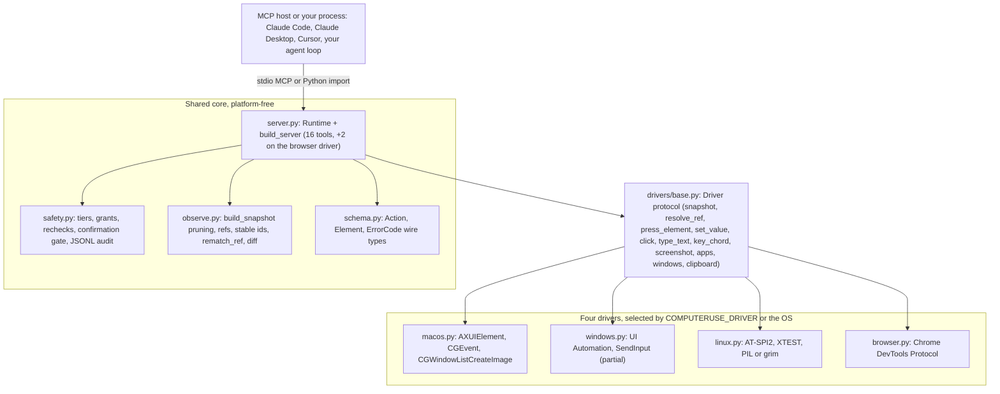

<p align="center">
  
</p>

<p align="center">
  <a href="https://github.com/Perception-Dynamics-Inc/computerUse/actions/workflows/ci.yml"></a>
  <a href="./LICENSE"></a>
  
  
  
</p>

<p align="center"><b>Accessibility-first computer use for AI agents: the model targets real UI elements by ref instead of guessed pixel coordinates, on macOS, Linux, and Chromium. Windows is partial: the model can snapshot by ref, type, and send key chords, but ref-targeted actions (<code>click</code>, <code>set_value</code>, <code>wait_for</code>, <code>act</code>) are not yet available through the server because <code>resolve_ref</code> is unimplemented.</b></p>

<p align="center">
  <a href="#quickstart">Quickstart</a> ·
  <a href="#connect-an-mcp-host">MCP hosts</a> ·
  <a href="#tool-surface">Tools</a> ·
  <a href="#why-computeruse">Why</a> ·
  <a href="#platform-support">Platforms</a> ·
  <a href="#embedding-computeruse">Embedding</a> ·
  <a href="#safety-model">Safety</a> ·
  <a href="#measured">Measured</a> ·
  <a href="#architecture">Architecture</a> ·
  <a href="#docs">Docs</a>
</p>


*A capture of a real run, encoded as a 12-frame GIF (820x528, about 2.5 s); the source recording is not in the repo. computerUse finds the text box as a labeled element ref rather than a pixel it guessed, activates it through the accessibility API, and types. The glowing cursor is computerUse's overlay cursor (`computeruse/overlay.py`), a standalone macOS module; per the commit that added this GIF (bad6136) it was drawn onto the frames in post, and the MCP server does not draw it during normal runs today. Ref clicks, `set_value` and scroll-into-view go through the accessibility API and leave the physical pointer where it is. Wheel scrolls, drags and raw x/y clicks are synthetic mouse events and do move it.*

> Status: v0.0.1, pre-release, installed from a clone (nothing is published on PyPI and nothing is tagged). Four `Driver` backends exist. macOS is the most complete and is live-verified only on a Mac that holds the Accessibility and Screen Recording grants. Windows is partial (observe, press, type, key chords). Linux and the browser backend run live in CI. The exact gates are in [Platform support](#platform-support).

## Quickstart

Python 3.11 or newer. `mcp<2` and `pillow` install with the package; the pyobjc frameworks install only on macOS.

### macOS

```bash
git clone https://github.com/Perception-Dynamics-Inc/computerUse.git && cd computerUse
python3 -m venv .venv && .venv/bin/pip install -e ".[dev]"    # or: uv venv && uv pip install -e ".[dev]"

# 1. Check the two one-time TCC grants (Accessibility, Screen Recording).
#    doctor runs 6 checks, names the .app that owns the grants (Terminal, your
#    IDE, Claude Desktop), and prints System Settings deep links. Relaunch that
#    app after granting.
.venv/bin/computeruse doctor

# 2. Read a running app's pruned accessibility tree with refs.
#    --app takes a bundle id or the display name, case-insensitive (default: the frontmost app).
#    --scope window|app: the frontmost window only, or all windows (default: window).
#    --mode full|interactive: interactive prints only actionable elements plus their
#      containers, static text folded into one line each (same refs, far fewer tokens).
#    --budget TOKENS caps the output at about TOKENS tokens (4 chars each); the tail is
#      replaced by a marker counting the omitted elements.
#    --bounds prints geometry on every element line (default: roots only in full mode,
#      none in interactive mode).
.venv/bin/computeruse snapshot --app TextEdit
.venv/bin/computeruse snapshot --app TextEdit --mode interactive --budget 800 --bounds

# 3. Grant TextEdit the full tier (the MCP session below uses the same grant),
#    then push one action through the gate from the CLI, with TextEdit open.
.venv/bin/python -c 'from computeruse import safety; safety.PermissionStore().set_tier("com.apple.TextEdit", safety.Tier.FULL)'
.venv/bin/computeruse run-once '{"tool": "app", "action": "focus", "name": "TextEdit"}'
```

`run-once` takes one JSON object with a `tool` key (`click`, `type`, `key`, `scroll`, `drag`, `app`, `window`, `clipboard`) and dispatches it through the same `Runtime` the MCP server uses. `app focus` gates against the resolved bundle id, so the grant above lets it through and it prints `focused com.apple.TextEdit`. `type` and `key` gate against the frontmost app instead, which is your terminal when you run them from a shell: without a grant for that bundle id they print `needs_permission: ...`, exit 1, and still write an audit entry under `~/.computeruse/audit/`. That is the safety layer working, not a crash. Refs are unavailable in `run-once` (a one-shot process has no snapshot), so `click`, `scroll`, and `drag` take x/y only. Exit code 2 means a usage or JSON error.

`computeruse doctor` exits 0 whenever it produces a report; failed checks are report content, not exit codes. The `computeruse snapshot` subcommand calls the macOS AX path directly and ignores `COMPUTERUSE_DRIVER`; `run-once` and `mcp` go through the driver seam. Its `--mode` accepts `full` or `interactive`; `diff` exists only on the MCP tool and the Python `Runtime` (`computeruse/cli.py`).

### Linux (AT-SPI2)

```bash
sudo apt install at-spi2-core gir1.2-atspi-2.0 gir1.2-gtk-3.0 python3-gi xvfb dbus dbus-x11 xclip
git clone https://github.com/Perception-Dynamics-Inc/computerUse.git && cd computerUse
python3 -m venv --system-site-packages .venv      # reuse apt's python3-gi so pip never builds PyGObject
.venv/bin/pip install -e ".[dev]" python-xlib
.venv/bin/computeruse mcp
```

That apt line is the one CI uses. The minimum is `at-spi2-core gir1.2-atspi-2.0`; `xclip` (or `xsel` or `wl-clipboard`) is for the clipboard tool, and `xvfb`, `dbus`, `dbus-x11` are for headless runs. `pip install -e ".[linux]"` is the alternative that pulls PyGObject and python-xlib from PyPI. The driver needs a reachable AT-SPI2 accessibility bus; if it is missing you get `permission_denied_accessibility` with an install hint. On Linux, observe through the MCP server or the Python `Runtime`, since `computeruse snapshot` is macOS-only. On native Wayland (`WAYLAND_DISPLAY` set, `DISPLAY` unset), the AT-SPI path over D-Bus is what remains: snapshot, `press`, plain ref clicks that resolve to an AT-SPI action, `set_value`, and typing into a field the driver focused; capture uses `grim`. Of these, snapshot, press, `EditableText` typing, and a `grim` screenshot were checked by hand once under headless sway on 2026-08-29 (`docs/linux-port.md`); `set_value` was not, and no test or CI step covers Wayland (the Linux job runs under Xvfb). Coordinate clicks, drags, wheel scrolls, key chords, and typing without a driver-focused field return `unsupported` (`computeruse/drivers/linux.py:48-63`); libei/RemoteDesktop-portal input is not implemented.

### Windows (partial)

```bash
pip install -e ".[dev,windows]"      # adds uiautomation
computeruse mcp
```

No permission dialog exists on Windows. In CI on `windows-latest` against Notepad, `desktop_snapshot` and `type` are proven through the gated Runtime; focusing the edit control via `press_element` and key chords (`ctrl+a`) are proven at the driver level; the `Invoke`/`Toggle`/`Select`/`Expand` press patterns are implemented but not live-asserted. `find` and `mode="diff"` run over the same snapshot path by code, not live-asserted. `set_value` (`ValuePattern`) and scroll-into-view (`ScrollItemPattern`) are implemented but not live-asserted. Fifteen methods still raise `NotImplementedError` naming their intended API: `resolve_ref` (so ref-based `click`, `set_value`, `wait_for`, and `act` fail through the Runtime), coordinate `click`/`drag`/`scroll`, `wait_for`, `screenshot`/`zoom_region` (DXGI), and the driver's `frontmost_app`, `app_at_point`, `running_apps`, `launch_app`, `activate_app`, `windows`, `read_clipboard`, `write_clipboard`. Details in [docs/windows-port.md](./docs/windows-port.md).

### Browser (Chromium over CDP)

```bash
pip install -e ".[dev,browser]"      # adds websocket-client, the only extra dependency
google-chrome --headless=new --remote-debugging-port=9222 about:blank &
COMPUTERUSE_DRIVER=browser COMPUTERUSE_CDP_ENDPOINT=http://127.0.0.1:9222 computeruse mcp
```

The browser driver is never selected by OS; set `COMPUTERUSE_DRIVER=browser` or call `get_driver("browser")`. The driver binds the first `type == "page"` target from `{endpoint}/json`; pass `target_id` to `BrowserDriver` to bind another tab. Inside a container add `--no-sandbox --disable-gpu --disable-dev-shm-usage --no-first-run --no-default-browser-check` and wait for `/json/version` before starting, as CI does. No `--remote-allow-origins` flag is needed; the WebSocket handshake suppresses the Origin header. Tabs are the "apps": `app list` returns CDP page targets, `app focus` binds a tab, `app launch` takes a URL and navigates, and permission grants are keyed by the CDP target id. The subcommand is `mcp`; `computeruse serve` does not exist.

## Connect an MCP host

The server speaks MCP over stdio. `computeruse mcp` takes no flags. The server name is `computeruse`, and its instructions tell the model to call `desktop_snapshot` first, prefer `mode="interactive"`, and act on refs.

```bash
# Claude Code, run from the repo root (the documented one-liner)
claude mcp add computeruse -- "$(pwd)/.venv/bin/computeruse" mcp
```

For hosts that read an `mcpServers` block (Claude Desktop, Cursor), the equivalent entry is:

```json
{
  "mcpServers": {
    "computeruse": {
      "command": "/absolute/path/to/computerUse/.venv/bin/computeruse",
      "args": ["mcp"]
    }
  }
}
```

For the browser backend, add the driver environment:

```json
{
  "mcpServers": {
    "computeruse-browser": {
      "command": "/absolute/path/to/computerUse/.venv/bin/computeruse",
      "args": ["mcp"],
      "env": {
        "COMPUTERUSE_DRIVER": "browser",
        "COMPUTERUSE_CDP_ENDPOINT": "http://127.0.0.1:9222"
      }
    }
  }
}
```

The JSON shape mirrors the tested stdio launch (`examples/mcp_subprocess.mjs`, `tests/e2e/test_mcp_stdio.py`). It has not been exercised against Claude Desktop or Cursor in this repo's CI. From Python, `tests/e2e/test_mcp_stdio.py` launches the same server with `StdioServerParameters(command=sys.executable, args=["-m", "computeruse", "mcp"], env={"HOME": ..., "PATH": ...})` and isolates state by pointing `HOME` at a temp directory; `python -m computeruse` works through `computeruse/__main__.py`.

On macOS the host is the responsible process, so it must hold the Accessibility grant (and Screen Recording for capture). Hosts that support MCP elicitation get the destructive-click confirmation prompt; hosts that do not will see such clicks blocked with `confirmation_declined` unless `COMPUTERUSE_CONFIRM=0` is set in `env`.

Environment variables the server reads:

| Variable | Effect | Default | When read |
|---|---|---|---|
| `COMPUTERUSE_DRIVER` | Backend: `macos`, `windows`, `linux`, or `browser`. Any other value raises `NotImplementedError`. | current OS | `drivers.get_driver()` |
| `COMPUTERUSE_CDP_ENDPOINT` | HTTP DevTools endpoint for the browser backend. | `http://127.0.0.1:9222` | `BrowserDriver()` |
| `COMPUTERUSE_AX_CLICKS` | `0` forces synthetic mouse events instead of AX press and AX scroll-into-view. | `1` | import of `computeruse.server` |
| `COMPUTERUSE_CONFIRM` | `0` disables the destructive-click confirmation gate. | `1` | import of `computeruse.server` |
| `COMPUTERUSE_NO_WEB_A11Y` | Any value disables the automatic force-enable of Chromium/Electron accessibility trees. | unset | each snapshot on macOS; `ensure_trusted()` on Linux |
| `COMPUTERUSE_ATSPI_EVENTS` | Linux only. Any value routes libatspi calls through a dedicated GLib event thread with cached reads and wakes `wait_for` on AT-SPI events. | unset | every libatspi call, via `_atspi_events.enabled()` |
| `COMPUTERUSE_SCREEN` | Linux only. `WxH` fallback for the primary screen size when Xlib is unavailable. | `1280x800` | snapshot display geometry (`_atspi.primary_geometry`) |
| `COMPUTERUSE_OVERLAY_RGBA` | macOS only. `r,g,b` or `r,g,b,a` color for the demo overlay, 0..1 floats or 0..255 ints. | `0.16,0.55,1.0,1.0` | `overlay._resolve_rgba()` |

`COMPUTERUSE_AX_CLICKS` and `COMPUTERUSE_CONFIRM` are module constants, so set them in the host's `env` block before the server process starts.

The `computeruse agent` and `computeruse bench h2h` CLI subcommands (not the MCP server) additionally read `COMPUTERUSE_PROVIDER` (planner backend: `anthropic`, `openai`, or `claude-cli`; unset means the first one the environment supports), `ANTHROPIC_API_KEY` / `ANTHROPIC_AUTH_TOKEN` / `ANTHROPIC_BASE_URL`, and `OPENAI_API_KEY` / `OPENAI_BASE_URL` (`computeruse/providers.py`); see [docs/agent-loop.md](./docs/agent-loop.md).

## Tool surface

16 tools on every driver, plus `console` and `network` on the browser driver only (18 total there). The counts are what `build_server().list_tools()` returns, and `tests/test_server.py` asserts the list. Every tool, including observation, passes through the same gate: permission check, optional confirmation, same-window recheck, execute, audit.

| Tool | What it does | Tier | Gated against |
|---|---|---|---|
| `desktop_snapshot(app, scope="window", mode="full", budget=None, include_bounds=false)` | Pruned accessibility tree with refs `e1..eN`. `scope` is `window` or `app`. `mode` is `full` (the whole pruned tree), `interactive` (the same snapshot cut to actionable elements plus the windows, dialogs, toolbars, and titled groups that contain them, static text folded into one `text:` line per container; same refs, fewer tokens; the server instructions tell the model to prefer it), or `diff` (only changes since the previous snapshot of the same app, rendered in the view last asked for). `budget=N` caps the reply at about N tokens (4 chars each) and replaces the tail with a marker counting the omitted elements. `include_bounds=true` prints geometry on every line (default: roots only in full mode, none in interactive). | read | scoped app |
| `find(app, text, role, editable, clickable, scope="window")` | Fresh snapshot filtered to matching elements. At least one filter is required. | read | scoped app |
| `screenshot(display_id, max_long_edge=1280, marks=false)` | Downscaled display capture plus a text line with the scale. `marks=true` draws Set-of-Mark ref labels from the latest snapshot (unit-tested with a fake driver, not live-verified; see [Observation engine](#observation-engine)). | read | frontmost app |
| `zoom(display_id, x, y, width, height)` | Native-resolution crop of a display region. | read | frontmost app |
| `click(ref \| x,y, button="left", count=1, modifiers, verify=false)` | Ref (AX press, no cursor movement) or point. Destructive labels require confirmation. `verify=true` appends the post-click diff. | click | ref's app, else frontmost |
| `type(text)` | Types into the focused element. Refuses secure fields on macOS. | full | frontmost app |
| `key(chord)` | One chord such as `cmd+s`. | full | frontmost app |
| `scroll(ref \| x,y, dx, dy, unit="lines", into_view=false)` | Wheel scroll, or `into_view=true` to reveal a ref through the accessibility API. | click | ref's app, else frontmost |
| `drag(start_ref \| start_x,start_y, end_ref \| end_x,end_y)` | Pointer drag between two targets. | click | start ref's app, else frontmost |
| `wait_for(ref, condition="exists", timeout_s=10)` | Poll until `exists`, `actionable`, or `gone`. Timeout clamps to 60 s. | read | ref's app |
| `act(steps, verify=false)` | Batched `click`/`type`/`key`/`scroll`/`drag`/`wait_for`, each gated at its own tier. Stops at the first failure, no rollback. | per step | per step |
| `set_value(ref, value)` | Sets an editable element's value in one accessibility operation; falls back to focus plus typing. Refuses secure fields. | full | ref's app |
| `scroll_to_find(app, text, role, direction="down", max_scrolls=6)` | Scroll and re-observe until a text or role match appears. | click | scoped app |
| `app(action, name)` | `list` (read), `launch`, `focus`. `quit` raises `ValueError`. On the browser driver these operate on tabs and `launch` takes a URL. | read / click | resolved app id (`launch`: the identifier if not running) |
| `window(action, window_id)` | `list` (read) and `raise`. `move`, `resize`, `minimize` raise `ValueError` in the MVP. | read / click | window owner |
| `clipboard(action, text)` | `read` (read) and `write` (full). Browser: read returns empty, write returns `unsupported`. | read / full | frontmost app |
| `console(app)` (browser only) | Buffered console messages as `{level, text}`; reading clears the buffer. | read | scoped tab |
| `network(app)` (browser only) | Buffered requests as `{method, url, status}` or `{method, url, error}`; reading clears the buffer. | read | scoped tab |

Errors reach the client as strings of the form `<code>: <message> | detail: {...} | hint: ...`. The codes are wire-stable: `stale_ref`, `permission_denied_accessibility`, `permission_denied_screen`, `secure_field`, `focus_changed`, `app_not_found`, `timeout`, `confirmation_declined`, `unsupported`. The MCP layer always appends a `computeruse doctor` hint to the two `permission_denied_*` codes. Refusals render as `<verdict>: <reason>` with verdicts `needs_permission` and `deny`.

## Why computerUse

The mainstream desktop computer-use agents, and the provider computer-use tools they are built on, drive a machine the same way: take a screenshot, have the model regress an (x, y) pair, click it, take another screenshot. That loop has four costs baked into its shape. It needs a vision model on every step. The target is a number the model estimated rather than an object the operating system already knows about. The synthetic click moves the user's pointer and steals focus. And the trajectory it leaves behind is a list of coordinates, so nobody can say afterwards what was clicked.

The browser world took another path years ago. [Playwright MCP](https://github.com/microsoft/playwright-mcp) serializes the accessibility tree and lets the model say `click e14`. computerUse applies that idea to native desktop apps and to Chromium, with the same core code on all four backends.

### Refs, not pixels

`desktop_snapshot(app)` returns a pruned accessibility tree, one line per element, two-space indented by depth, with the `AX` role prefix stripped and flags comma-joined. The format, on an illustrative TextEdit window:

```text
[snap-7] com.apple.TextEdit (window)
  e1 window "Untitled" [1024x768 @1:0,0]
    e2 textarea ="Hello" (edit,focus)
    e3 button "Save" (click)
```

Refs are `e1..eN`, assigned in pre-order per snapshot, and they are snapshot-scoped. At act time the anchor is matched against a fresh live tree: an exact `stable_id` match first (`AXIdentifier` on macOS, `AutomationId` on Windows, `accessible-id` on Linux, the backend DOM node id in the browser), then a role, title, path and bounds ladder. When nothing resolves, the error is `stale_ref` and it carries up to three same-role `candidates` from the live tree, so the model can correct itself on the next call.

What that buys you, stated at the level the code supports today:

- The model targets a real element. `click(ref="e14")` re-resolves the ref against the live tree at act time. A failed resolve returns `stale_ref` with the nearest candidates instead of clicking the wrong place.
- Any model can read it. Snapshots are plain text, so a text-only or local model can consume them without a vision step; no run with such a model is recorded in this repo (the `computeruse agent` OpenAI-compatible planner accepts an Ollama `OPENAI_BASE_URL`, but that recipe was not run; see [docs/agent-loop.md](./docs/agent-loop.md) and [Roadmap](#roadmap)). Vision is a fallback path, not a requirement.
- Ref actions do not fight you for the mouse. On macOS a plain left click on a ref goes through `AXPress`, `set_value` sets `AXValue`, and `scroll(into_view=true)` uses `AXScrollToVisible`. Wheel scrolls, drags, and raw coordinate clicks still synthesize pointer events.
- Re-observation is cheap. `desktop_snapshot(mode="diff")` returns only what changed; an unchanged page costs about 10 tokens in the browser benchmark below.
- Every gated action is audited. A JSONL log records the decision, the parameters (with secure-field and clipboard redaction), the result, and the duration. Failures raised before the gate leave no entry: a `stale_ref` from ref resolution, a `secure_field` refusal from `set_value`, and invalid arguments (`ValueError`). The `verify=true` re-snapshot is not gated or audited on its own. See [Safety model](#safety-model).
- It embeds. Your app imports the library or spawns `computeruse mcp`; the OS permission grants attach to your signed app, and computerUse ships no certificate.

This is not a token-savings pitch on the desktop. A pruned window snapshot of a rich native macOS app costs about as much as one screenshot (see [Measured](#measured)). The case rests on targeting, model choice, non-intrusiveness, auditability, and cheap re-observation.

## Platform support

| Marker | Meaning |
|---|---|
| ✔ | implemented and verified live (in CI, or on a Mac that holds the TCC grants; in run 33436980587 the `macos-latest` runner held both grants and the granted-path macOS tests ran there) |
| ✔* | implemented on macOS with no automated live test; checked by hand on a granted developer Mac, not recorded in this repo with a date or commit (see the note under the table) |
| ◐ | implemented but not live-verified, or gated as noted |
| ✘ | not implemented, or a structured `unsupported` error |

| Capability | macOS (AX) | Windows (UIA) | Linux (AT-SPI2) | Browser (CDP) |
|---|---|---|---|---|
| Snapshot | ✔ TCC-gated | ✔ CI-live (Notepad) | ✔ CI-live (GTK3 under Xvfb) | ✔ CI-live; same-process (`srcdoc`) iframes stitched live; cross-origin iframes skipped (hermetic test only); 24-frame cap (untested) |
| `find`, diff | ✔ TCC-gated | ◐ same snapshot path; hermetic tests only, not live-asserted | ◐ same snapshot path; hermetic tests only, not live-asserted | ◐ `find` hermetic only; `diff_snapshots` runs live in CI via cu-arena (`rounds=2`) but its output is not asserted, and `mode="diff"` through the Runtime is hermetic only |
| Ref re-resolution | ✔ | ✘ `NotImplementedError` | ✔ | ✔ stable id = backend DOM node id |
| Press a ref (accessibility) | ✔ `AXPress` | ◐ driver-level only: `press_element` on Notepad's edit control (the `SetFocus` branch) returns True and the edit takes typed text (`tests/test_windows_live.py:75`); the `Invoke`/`Toggle`/`Select`/`Expand` branches (`windows.py:85-97`) have no live test; ref press through the Runtime fails until `resolve_ref` lands | ✔ CI-live | ✔ CI-live |
| `set_value` | ✔* `AXValue` | ◐ not live-asserted | ◐ not live-asserted | ◐ hermetic tests only |
| Type text | ✔ | ✔ CI-live | ✔ CI-live via EditableText; Wayland needs a driver-focused field | ✔ CI-live |
| Key chord | ✔* | ✔ CI-live | ◐ XTEST, parser tested only; ✘ on native Wayland | ◐ hermetic tests only |
| Coordinate click, drag, scroll | ✔* TCC-gated | ✘ | ◐ XTEST on X11, no live test; ✘ on native Wayland | ◐ implemented, no test coverage |
| `wait_for` | ✔* TCC-gated | ✘ `NotImplementedError` | ◐ poll, not live-asserted; AT-SPI event wake with `COMPUTERUSE_ATSPI_EVENTS=1` | ◐ poll, not live-asserted |
| Screenshot and zoom | ✔ Screen Recording TCC; `zoom` ✔* | ✘ DXGI planned | ◐ PIL on X11, `grim` on Wayland, no live test | ✔ `Page.captureScreenshot` |
| App verbs and `window list` | ✔* (`app focus` runs in the live smoke test) | ✘ | ◐ EWMH, X11 only, not live-tested | ◐ tabs as apps; hermetic tests only |
| `window raise` | ✔* | ✘ | ✘ macOS-only code path | ✘ macOS-only code path |
| Clipboard | ✔* | ✘ | ◐ xclip, xsel, wl-clipboard; not live-tested | ✘ read empty, write `unsupported` |
| `console`, `network` | ✘ not registered | ✘ not registered | ✘ not registered | ✔ CI-live |
| Permission model | Accessibility + Screen Recording grants | none | reachable AT-SPI2 accessibility bus | reachable CDP endpoint |
| Grant key (app identity) | bundle id | process image name (`notepad.exe`) | process comm name (`gedit`) | CDP tab id |

Notes on the gates:

- macOS live paths need the TCC grants on the process that runs computerUse. In CI run 33436980587 (job `macOS · full suite`, `macos-latest`) the runner held both the Accessibility and Screen Recording grants: mapping the job's `pytest -q` progress string onto the collection order puts its 5 macOS skips on the ungranted-path tests (`tests/e2e/test_mcp_stdio.py`, `tests/test_cli.py`, two in `tests/test_doctor.py`, `tests/test_capture.py`), which only run on a machine *without* a grant, while the granted-path live tests (`tests/e2e/test_live_smoke.py`, `tests/test_observe.py::test_snapshot_live_smoke`, `tests/test_act.py`, `tests/test_doctor.py`, `tests/test_capture.py`, `tests/e2e/test_mcp_stdio.py`) ran and passed. The result was `370 passed, 20 skipped`: those 5 plus the 15 off-platform live tests present at 3b331ba (5 Linux, 5 Windows, 4 browser CDP, 1 cu-arena; 20 at f5bef72), which only run in their own jobs. On a Mac with neither grant the same suite at 3b331ba was `368 passed, 22 skipped`; at f5bef72 it is `534 passed, 28 skipped` (see CONTRIBUTING.md). Whether every `macos-latest` image carries the grants is not something the workflow controls; treat the grants as an environment property and read the skip list, which the macOS step now prints with `pytest -q -rs`.
- Asterisked macOS cells: automated live coverage on a granted Mac is narrow. It is a read-only Finder AX walk (`tests/test_observe.py::test_snapshot_live_smoke`), one ref click plus typing into TextEdit with AX verification (`tests/e2e/test_live_smoke.py`, which also calls `app focus` and posts `cmd+s`/`cmd+w` in a best-effort teardown that is not asserted), one mouse move to the cursor's current position (`tests/test_act.py`), a screenshot dimension check (`tests/test_capture.py`), the `doctor` grant probes (`tests/test_doctor.py`), and one granted `desktop_snapshot` over MCP stdio (`tests/e2e/test_mcp_stdio.py`). Coordinate click, drag, wheel scroll, `wait_for`, `zoom`, `set_value`, key chords, `window list`, `window raise`, and clipboard on macOS have no automated live test; their asterisked marker rests on manual runs on a granted developer Mac that this repo does not record with a date or commit. Treat them as implemented and manually checked, not CI-verified.
- Off macOS the identity story is shorter. Windows has no TCC analog; `WindowsDriver.ensure_trusted()` returns `None`, and a code comment notes that input to a window running at a higher integrity level (UIPI) is silently dropped by the OS rather than surfaced as a structured error. Linux needs a reachable AT-SPI2 accessibility bus and has no per-app grant; a missing bus or missing PyGObject raises `permission_denied_accessibility` with an install hint. The browser driver needs a reachable DevTools endpoint and the `websocket-client` package.
- The Windows `resolve_ref` gap means ref-based `click`, `set_value`, `wait_for`, and `act` fail through the Runtime today; the full list of unimplemented methods is in the [Windows quickstart](#windows-partial).
- The Linux Wayland matrix (accessibility actions and `grim` capture native; raw XTEST input `unsupported` with a hint that libei or the RemoteDesktop portal is planned) is described in `docs/linux-port.md`. No test or CI step in the repo exercises Wayland; one manual check under headless sway on 2026-08-29 is recorded in `docs/linux-port.md`, so treat that row as implemented-by-code with a single manual check, not verified by any test.
- The browser iframe stitcher walks `Page.getFrameTree` and grafts same-process frames (same-origin, `about:blank`, `srcdoc`) under their owner element. Out-of-process cross-origin iframes raise inside CDP and are skipped without failing the snapshot. There is no live cross-origin test.
- Each backend is proven where it can run in a container. The browser driver runs in CI against headless Chrome on `ubuntu-latest`. The Linux driver runs in CI against a real GTK3 window under `xvfb-run` with a D-Bus session and `at-spi-bus-launcher`. The Windows driver runs in CI against Notepad on `windows-latest`.

## Embedding computerUse

computerUse is infrastructure for people building agent products. Two shapes, and in both your app is the identity the OS trusts.

| | In-process | MCP subprocess |
|---|---|---|
| Shape | `import computeruse`, construct `server.Runtime()` | spawn `computeruse mcp`, speak MCP over stdio |
| Host language | Python 3.11+ | any; Node shown below, the e2e suite drives it from Python |
| Identity | runs as your process | child of your process; TCC's responsible process is your signed app |
| Confirmation channel | you pass a `confirm` callback | MCP elicitation, rendered by the host |
| Example | `examples/inprocess_python.py` | `examples/mcp_subprocess.mjs` |

In-process (Python hosts):

```python
from computeruse import safety, server

store = safety.PermissionStore()                       # ~/.computeruse/permissions.json
store.set_tier("com.apple.TextEdit", safety.Tier.FULL)

runtime = server.Runtime(store=store)                  # audit log defaults to ~/.computeruse/audit/
print(runtime.desktop_snapshot("com.apple.TextEdit", scope="window"))
print(runtime.click(ref="e3", verify=True))            # AX press, then the post-click snapshot diff
print(runtime.type_text("hello"))
```

`Runtime(*, store=None, audit=None, driver=None)` defaults to `PermissionStore()`, `AuditLog()`, and `drivers.get_driver()`. Methods return `str`, except `screenshot` (text plus a `capture.ScaledImage`) and `zoom` (PNG bytes), and raise `ComputerUseError` or `ActionRefused`. `Runtime.click` defaults `confirm=None`, so with the confirmation gate on, a ref click on a destructive label is blocked with `confirmation_declined` unless you pass a `confirm` callback or set `COMPUTERUSE_CONFIRM=0`. `Runtime.dispatch(tool, params)` accepts `click`, `type`, `key`, `scroll`, `drag`, `app`, `window`, `clipboard`.

Subprocess over MCP (any language; Node shown, from `examples/mcp_subprocess.mjs`):

```js
import { Client } from "@modelcontextprotocol/sdk/client/index.js";
import { StdioClientTransport } from "@modelcontextprotocol/sdk/client/stdio.js";

const transport = new StdioClientTransport({ command: "computeruse", args: ["mcp"] });
const client = new Client({ name: "my-ai-platform", version: "0.1.0" });
await client.connect(transport);

const snap = await client.callTool({
  name: "desktop_snapshot",
  arguments: { app: "com.apple.finder", scope: "window" },
});
console.log(snap.content[0].text);
```

The integrator's checklist (macOS; Windows and Linux notes live in `docs/windows-port.md` and `docs/linux-port.md`):

1. Sign your app with your own Developer ID on macOS, or an Authenticode certificate on Windows. computerUse ships no certificate and needs none.
2. Request the OS permissions your app uses: Accessibility always on macOS, Screen Recording only if you use the `screenshot`/`zoom` vision fallback. `computeruse doctor` runs 6 checks (`responsible_app`, `accessibility_grant`, `screen_recording_grant`, `python_version`, `pyobjc_version`, `mcp_import`), names the `.app` bundle in the parent chain that the grants attach to, and prints System Settings deep links.
3. Handle hardened-runtime library validation for notarization: embed in-process, sign the bundled components with your Team ID, or set `com.apple.security.cs.disable-library-validation`.
4. Subprocess model only: make sure TCC's responsible process resolves to your signed app (embed in-process, or ship the helper signed with your Team ID at a stable path). `doctor` prints the responsible app so you can check.

Your users grant permissions to your trusted app once, and the grants survive your updates because the identity is yours and stable.

## Observation engine

The engine in `computeruse/observe.py` is shared by all four drivers. Each driver supplies an accessor over its native tree; the engine does the pruning, indexing, and matching.

- Refs and epochs. Each snapshot gets an id `snap-N`. Refs are valid only against their own snapshot; the Runtime keeps one current epoch, replaced by `desktop_snapshot`, `find`, each step of `scroll_to_find`, and the `verify=true` re-snapshot. Targeting a ref from an older epoch returns `stale_ref` telling the model to re-observe. Live AX handles are retained for the last 8 epochs.
- Stable ids. When present, an exact (stable id, role) match is authoritative, so a button that changed both title and position still resolves.
- Re-resolution ladder. Without a stable id, candidates of the same role score 4 for a title match and 2 for a path match; partial matches must lie within 400 px; ties within 2 px are reported as ambiguous rather than guessed.
- Self-correcting `stale_ref`. The error detail carries `reason` (`not_found` or `ambiguous`), the anchor, and up to 3 `candidates` of the same role ranked by score and proximity.
- Interactive view. `mode="interactive"` keeps elements that are clickable or editable (disabled ones included), carry `checked`, `expanded`, `selected`, or `focused` state, or have a selectable role (rows, tabs, sliders, incrementors), plus the containers needed to tell them apart (roots, windows, sheets, dialogs, drawers, popovers, menus, menu bars, toolbars, tab groups, web areas, and any titled group). Everything else folds into one `text:` line per kept container (96 characters, 12 items, then `(+N)`). Refs are the snapshot's own refs, so `click`, `set_value`, `wait_for`, and `act` resolve them exactly as full-view refs. `budget=N` caps any view at about N tokens: the header always survives, lines are kept in order, and a trailing marker counts the omitted element lines. Measurements and guidance on which view to use are in [docs/observation-cost.md](./docs/observation-cost.md).
- Diff snapshots. `mode="diff"` renders a header `[new_id <- old_id] +A -R ~C` (the real header uses a left arrow glyph) followed by added, removed, and changed lines (value, title, enabled, focused, checked, selected, expanded, or moved bounds). Without a prior same-app snapshot it falls back to a plain render in the view last requested (`full` or `interactive`). Diffs and Effect Receipts render in the view the agent last asked for; in the interactive view static-text changes fold into one `~ text:` line and added or removed static elements are reported as counts.
- `find`. Case-insensitive substring on title or value, role match with the `AX` prefix ignored, and exact `editable`/`clickable` flags. Every match line carries bounds.
- `wait_for`. `exists`, `actionable` (enabled and clickable or editable), or `gone`, polled every 0.1 s at read tier, clamped to 60 s, returning `timeout` on expiry.
- `act` batch. Steps keyed by `do`, each gated and audited like its standalone tool. The batch stops at the first failure and reports `{i, do, ok, error}`; completed steps are not rolled back.
- `set_value`. One accessibility operation (`AXValue` on macOS, `ValuePattern` on Windows, `EditableText` on Linux, the native value setter plus `input`/`change` events in the browser), with focus-and-type as the fallback.
- `scroll_to_find`. Up to `max_scrolls` observe-scroll rounds against the largest scroll area, 5 lines per step, returning the matches and the number of scrolls it took.
- Effect Receipts. `verify=true` on `click` and `act` re-snapshots the same app and scope after the action and appends the diff, so the model sees what its action changed without a second call. `type`, `key`, `scroll`, `drag`, and `set_value` do not take `verify`.
- Set-of-Mark screenshots. `screenshot(marks=true)` draws each clickable or editable element's ref from the latest snapshot on the downscaled image so a vision model can answer `click e7` and the accessibility path executes it (`computeruse/marks.py`). Bounds are mapped through `ScaledImage.from_source` (`computeruse/marks.py:62`); the first version called a nonexistent `to_scaled` and raised `AttributeError` whenever there was an element to mark, fixed in 40973f2. Covered by `tests/test_marks.py` (3 tests against a stub `ScaledImage`) and `tests/test_adapters.py::test_marks_draw_refs_on_the_screenshot`, which runs `Runtime.screenshot(marks=True)` against a fake driver and asserts the mark ink lands on the image. No test renders marks against a live display on any platform, so treat the marks path as implemented and test-verified with a fake driver, not live-verified.
- Vision handoff. When a full snapshot finds zero interactive elements, the text ends with a note that the app is likely custom-drawn (Telegram is the reference case) and points the model at `screenshot` plus coordinates. It is a hint only; no screenshot is taken automatically.
- Chromium and Electron trees. On macOS the observer sets `AXManualAccessibility` and `AXEnhancedUserInterface` once per pid when it detects a web area; on Linux it flips `org.a11y.Status` over D-Bus. Both are on by default and disabled by `COMPUTERUSE_NO_WEB_A11Y`.
- Cursor-free actions. A plain left single click on a ref tries `press_element` first (`AXPress`, `AXConfirm`, `AXOpen`, `AXPick`, or `AXFocused` for editables) and falls back to synthetic mouse events only when that returns false. `COMPUTERUSE_AX_CLICKS=0` turns the preference off.
- Overlay. `computeruse/overlay.py` draws a click-through screen-edge glow and an agent cursor (white arrow, blue glow) on macOS. It is not wired into the server, the drivers, or the CLI; `python -m computeruse.overlay` runs an 8-second demo.

## Safety model

Every action, observation included, goes through `Runtime._run_gated`: `check_action`, then the confirmation gate, then a same-window recheck, then execution, then an audit write.

### Tiers and grants

| Tier | Allows | Tools at this tier |
|---|---|---|
| `read` | observe only, no input | `desktop_snapshot`, `find`, `screenshot`, `zoom`, `wait_for`, `app list`, `window list`, `clipboard read`, `console`, `network` |
| `click` | `read` plus pointer actions | `click`, `scroll`, `drag`, `scroll_to_find`, `app launch`, `app focus`, `window raise` |
| `full` | everything, including typing and keys | `type`, `key`, `set_value`, `clipboard write` |

Grants live in `~/.computeruse/permissions.json` (override with `PermissionStore(path)`):

```json
{"apps": {"com.apple.TextEdit": {"tier": "full"}}, "deny": [], "allow": []}
```

An app on `deny` is refused at every tier. A non-empty `allow` list is a whitelist. The store re-reads the file when its mtime or size changes, so a human can edit grants while a server is running. An app with no grant gets `needs_permission`, including for `read`: an ungranted app's snapshot or screenshot is refused rather than silently captured. No MCP tool grants a tier, so the model cannot grant itself access. The only grant paths are human-driven: edit the file, call `PermissionStore().set_tier`, or pass `--grant {read,click,full}` to `computeruse agent`, which calls `PermissionStore.set_tier` for the resolved target app before the run and persists it like any other grant (`computeruse/cli.py`).

### Which app an action is checked against

Ref-based actions (`click`, `scroll`, `drag`, `wait_for`, `set_value`) gate against the app of the snapshot that issued the ref. Coordinate clicks, `type`, `key`, `clipboard`, `screenshot`, and `zoom` gate against the frontmost app. `desktop_snapshot`, `find`, `console`, and `network` gate against the scoped app. `app focus` and `app launch` gate against the resolved app id (`launch` falls back to the raw identifier when the app is not running); `window raise` gates against the window's owner.

### Rechecks between decision and injection

- `type` and `key` compare the gated app to the frontmost app immediately before injecting and return `focus_changed` with `{"gated_app", "frontmost_app"}` in the detail if they differ.
- `click`, `scroll`, `drag`, and `set_value` hit-test the target point (on macOS, front-to-back over the on-screen window list) and return `focus_changed` with `{"gated_app", "app_at_point"}` if another app's window now covers it. If the owner cannot be determined the recheck degrades to a no-op.
- `wait_for`, the observation tools, the `app`/`window`/`clipboard` verbs, and the inner loop of `scroll_to_find` run no recheck.

### Secure fields

- `AXSecureTextField` elements (and `<input type="password">` in the browser, `password text` on Linux) are marked `secure`, and their value is never emitted.
- Every driver's `press_element` and `set_value` return false for a secure element. On macOS the fallback click then raises `secure_field`, and `type` refuses when `IsSecureEventInputEnabled()` is true or the system-wide focused element is a secure field. On the browser and Linux backends the coordinate click path does not check `secure`, and their `type` has no focused-secure-field probe; protection there is limited to the press and `set_value` refusals. No Windows UIA password-field mapping was found in the code.
- `Runtime.set_value` refuses a secure target before the gate, so that particular refusal is not audited; ref resolution (`stale_ref`) also runs before the gate for every ref-targeted tool and is likewise unaudited.

### Confirmation gate for irreversible clicks

- `safety.confirmation_prompt` fires only for a ref click whose element title contains one of `delete`, `move to trash`, `empty trash`, `trash`, `discard`, `erase`, `uninstall`, `permanently`, `wipe`, or `don't save` (either apostrophe form). Coordinate clicks, typing, keys, and `set_value` are never classified. The classifier is click-only and label-based. `send`, `remove`, and `reset` are deliberately not on the list.
- The `click` and `act` tools ask the host through MCP elicitation. Accept runs the click; anything else, including a host without elicitation, blocks with `confirmation_declined`. `COMPUTERUSE_CONFIRM=0` disables the gate. Details in `docs/confirmation-gate.md`.

### Audit log

Always on. One JSONL file per UTC day at `~/.computeruse/audit/YYYY-MM-DD.jsonl`; override the directory with `AuditLog(dir_path)`. Each entry has:

```text
ts        epoch float
app       the gated app id
action    lowercase action class name, for example click, typetext, observeop
params    the action's fields (enums as strings, nested targets as dicts)
decision  {verdict, app, required, granted, reason}
result    "ok", a verdict ("needs_permission", "deny"), or an ErrorCode value
metrics   {duration_ms, result_chars, tokens_est}    with tokens_est = (chars + 3) // 4
```

Redaction is fixed, not configurable. `text` and `chord` become `[REDACTED]` when the action hit a secure field or is any clipboard operation; element `value` fields inside targets are always redacted while role, title, path, and bounds stay. Non-secure typed text is kept for replay. Input validation failures (bad modifiers, bad chord, missing target) raise `ValueError` before the gate and produce no audit entry. `computeruse bench audit [dir]` aggregates the log into per-action latency and token counts.

## Measured

Three measurement sets exist. They cover different surfaces and are not interchangeable.

| Surface | What was measured | Result | Provenance |
|---|---|---|---|
| macOS desktop | Pruned window snapshots of rich native apps (Safari, Chrome, Calendar) | about 680 to 1,460 tokens per snapshot; Calendar month grid about 3,220; a single screenshot about 1,100 to 1,600 tokens. Conclusion: comparable to one screenshot, not 10x smaller. | Measured 2026-07-12 (COM-6), recorded in `docs/phase-0-review.md`. The token estimator and screenshot resolution are not documented. Not re-measured since, and per-widget dense-grid pruning (`DENSE_MAX_CHILDREN=12`) landed on 2026-07-13, after the Calendar figure. |
| Browser (cu-arena) | Same page state captured both ways on headless Chromium: accessibility snapshot text vs a screenshot of the frame | 11-element test page, 349 chars: accessibility snapshot 88 tokens per observation vs screenshot 454 tokens (780x437 CSS px), a 5.2x ratio. Re-observing the unchanged page as a diff: 10 tokens on average vs 454 for another screenshot. | Printed by the browser CI job on every run inspected from 2026-08-29 to 2026-08-31 (run 33436980587 on `3b331ba`). Both figures are estimates: chars/4 for text, width x height / 750 for images. |
| Browser, real pages (cu-arena) | example.com and news.ycombinator.com observed in every view (`full`, `interactive`, `diff`) against one screenshot, before and after the prune depth-cap fix (a9e42d9) | example.com: 95 tok full, 72 tok interactive vs 473 to 876 tok screenshot depending on frame size; Hacker News (330 to 435 elements): 4,509 to 4,539 tok full vs 1,301 to 2,072 tok screenshot (the full tree costs more than the screenshot on a dense page), 758 to 1,089 tok interactive; re-observe diff 10 tok either way. | Run by hand on 2026-09-02 against headless Chrome 152 (`--remote-debugging-port=9555`, then 9777), recorded with the exact commands in [docs/observation-cost.md](./docs/observation-cost.md). Not reproduced in CI (the browser job runs only the 11-element test page above). `computeruse bench desktop --app Finder` on the same machine returned `permission_denied_accessibility`, so the desktop side has no new number. |

Read the browser row carefully. The accessibility-snapshot side grows with element count while the screenshot side is fixed by viewport, so the 5.2x ratio on a trivial page does not carry to dense pages. The diff advantage does not depend on page size. A head-to-head task benchmark against a pixel-loop agent now has a harness: `computeruse bench h2h` (`computeruse/h2h.py`, 12 browser fixtures in `computeruse/arena_tasks/`, method in [docs/benchmark.md](./docs/benchmark.md)) runs the same planner on refs, on pixels, and on pixels with snap-to-ref, scoring completion, turns, misclicks, wasted actions, tokens, cost, and wall time. It is hermetic-tested in `tests/test_h2h.py`, its two live tests self-skip without a CDP endpoint, and no dated result from it is recorded in this repo (the `docs/benchmarks/` directory it names does not exist yet). The rows above measure observation cost only.

Reproduce it:

```bash
computeruse bench web <url> --rounds 3 --endpoint http://127.0.0.1:9222   # accessibility-snapshot vs screenshot observation cost on the browser driver (full view)
computeruse bench web <url> --rounds 3 --mode interactive --json          # cost the interactive view instead; machine-readable report
computeruse bench desktop --app <app> --rounds 3                          # every snapshot view vs one screenshot on the OS driver; on macOS needs the Accessibility and Screen Recording grants
COMPUTERUSE_DRIVER=browser computeruse bench desktop --rounds 3           # same, on the bound Chromium tab
computeruse bench audit                                                   # aggregate ~/.computeruse/audit/*.jsonl: tokens_est, p50/p95 latency
```

Method and live numbers for `bench desktop` and `--mode interactive` are in [docs/observation-cost.md](./docs/observation-cost.md); `computeruse bench h2h --list` prints the head-to-head task suite ([docs/benchmark.md](./docs/benchmark.md)).

Tests and CI, from run 33436980587 on commit `3b331ba` (all four jobs green):

- At 3b331ba: 390 tests collected across 20 modules; locally on the author's Mac, with no TCC grants for the test process, that suite reported 368 passed and 22 skipped. At the current head (`f5bef72`, not yet run through CI): `pytest --collect-only -q` reports 562 tests across 24 modules (new since 3b331ba: `tests/test_adapters.py`, `tests/test_agent.py`, `tests/test_providers.py`, `tests/test_h2h.py`, plus additions to `test_observe`, `test_cli`, `test_arena`, and `test_server`); locally with no TCC grants and no CDP endpoint, `pytest -q -rs` reports 534 passed and 28 skipped (5 Accessibility, 2 Screen Recording, 1 needing both grants, 10 with no CDP endpoint, 5 Linux-only, 5 Windows-only). Re-run `pytest -q -rs` and update these numbers with the run id before release.
- At 3b331ba, macOS full suite: 370 passed, 20 skipped. The 20 skips are the 15 off-platform live tests then present (5 Windows UIA, 5 Linux AT-SPI, 4 live-CDP browser, 1 cu-arena; the head has 20 such tests: those plus 1 more cu-arena, 1 adapters, 1 agent, and 2 h2h CDP-gated tests) plus the 5 ungranted-path TCC tests, which skip because the `macos-latest` runner held both the Accessibility and Screen Recording grants. The 7 granted-path macOS live tests (TextEdit smoke, MCP stdio snapshot, CGEvent post, live screenshot, two doctor grant probes, Finder AX snapshot) are inferred to have run and passed: that run's step was `pytest -q` without `-rs`, so the log shows only the progress string and `370 passed, 20 skipped`, and the 20 `s` positions in the progress string, indexed against the 390-test collection order at `3b331ba`, land on the 5 ungranted-path TCC tests and the 15 off-platform live tests, with a `.` at each of the 7 granted-path tests. The count alone would not settle it (an Accessibility-only runner also yields 20 skips: 15 off-platform, 3 ungranted-path, 2 Screen-Recording-gated); the positions do. The macOS step has since been changed to `pytest -q -rs`, so later runs print the skip reasons directly.
- At 3b331ba, Windows: 48 passed, 4 skipped in the core suite; 5 passed in the live UIA tests against Notepad.
- At 3b331ba, Browser: 28 passed, 4 skipped hermetic; 4 live tests passed against headless Chrome (observe/act/verify, iframe, console, network); 1 live cu-arena test passed.
- At 3b331ba, Linux: 55 passed, 4 skipped synthetic; 5 passed live against a real GTK3 window under Xvfb, D-Bus, and `at-spi-bus-launcher`.

The run before it (`bcce4fa`) failed only in the browser job's Chrome launch step; `3b331ba` added `--disable-dev-shm-usage` and a wait-and-diagnose loop.

## Architecture



The pruning engine, ref re-resolution, diffing, the safety layer, and the MCP surface are written once. A driver supplies the tree accessor, the press/set/type/key primitives, capture, and system queries. The Windows and Linux CI jobs build the MCP server to prove the core imports without pyobjc.

### How the loop runs

<p align="center"></p>

The model never touches the machine. It emits structured actions; the client (this framework, inside your process) executes them and feeds back what it observes.

1. Observe: `desktop_snapshot(app)` returns a pruned tree with refs; `mode="interactive"` keeps only actionable elements, `find` narrows it, `mode="diff"` returns only what changed.
2. Decide: the model picks a tool call, for example `{"tool": "click", "ref": "e14"}`, or an `act` batch.
3. Gate: `check_action` looks up the app's tier, the confirmation classifier runs for destructive labels, and the same-window recheck runs right before injection.
4. Execute: the ref is re-resolved against the live tree (stable id first), then pressed through the accessibility API (`AXPress`, UIA Invoke, AT-SPI `do_action`, CDP `this.click()`); coordinate actions synthesize input events instead.
5. Verify and repeat: `verify=true` returns an Effect Receipt; `wait_for` blocks on `exists`, `actionable`, or `gone`; every attempt lands in the audit log.

The server's instructions tell the model to call `desktop_snapshot` first, prefer `mode='interactive'` and re-observe with `mode='diff'`, act on refs, re-observe on `stale_ref`, and run `computeruse doctor` on `permission_denied_*` (`_INSTRUCTIONS`, `computeruse/server.py`).

## Non-goals

- Not a screenshot-loop browser agent. The browser backend is a `Driver` behind the same core and MCP surface, coordinate-free on its ref path (coordinate click, drag, and scroll exist only as the vision fallback), with `console` and `network` as extra observations.
- No VM or sandbox infrastructure; integrate E2B, cua, or Docker.
- No foundation model.
- No eval-harness-in-CI product until users ask twice.
- No consumer `.app`, no signing certificate, no notarization on our side. The host app owns identity and permissions.
- IME and dead-key composition are out of scope for the per-character injection path.
- Games and anti-cheat on Windows are out of scope (synthetic input carries `LLHF_INJECTED`).

## Roadmap

Done:

- Phase 0 closed with a GO verdict on 2026-07-13: demand validation (30 sourced stories kept from 65 mined after dedupe and quality filtering, kill criterion 20), hero workflow on Calendar via refs alone, per-app coverage table, confirmation gate, language decision (stay Python), name decision.
- macOS driver, pruning engine, vision-handoff note, MCP server plus CLI, safety v1 (tiers, JSONL audit, secure-field redaction, confirmation gate).
- Beyond the original plan: Linux AT-SPI2 backend, browser CDP backend with console and network, `find`, `act` batch, `set_value`, `scroll_to_find`, diff snapshots, stable-id anchors, stale-ref candidates, Effect Receipts, cu-meter, cu-arena.
- `desktop_snapshot(mode="interactive")` and the `budget` token cap (`computeruse/observe.py`, 99b8d0b); `computeruse bench desktop`, which costs every snapshot view of a running app against one screenshot (`computeruse/arena.py`, 910a530). Method and numbers are in [docs/observation-cost.md](./docs/observation-cost.md); the desktop side there has no measured number yet, because the shell that ran it held no Accessibility grant.

Partial:

- Windows: observe (`desktop_snapshot`), type, and key chords are in and CI-verified against Notepad (`tests/test_windows_live.py` on `windows-latest`; snapshot and `type` through the gated Runtime, press and `ctrl+a` at the driver level); accessibility press (`press_element`) is CI-verified only for its `SetFocus`-on-editable branch (the `Invoke`/`Toggle`/`Select`/`Expand` pattern branches are implemented but not live-asserted); `set_value` (`ValuePattern`) and scroll-into-view (`ScrollItemPattern`) are implemented but not live-asserted, and neither is reachable through the Runtime until `resolve_ref` lands; the remaining 15 driver methods raise `NotImplementedError` (list in the [Windows quickstart](#windows-partial)).
- Set-of-Mark screenshots: implemented (`computeruse/marks.py`); the `to_scaled` bug was fixed in 40973f2. Unit-tested through the real `ScaledImage` path with a fake driver (`tests/test_adapters.py::test_marks_draw_refs_on_the_screenshot`) and against a stub (`tests/test_marks.py`); no live-desktop test.
- Overlay: built as a standalone macOS module, not integrated into the server.
- Head-to-head benchmark against a pixel-loop reference (completion rate, misclicks, steps, cost): the harness exists as `computeruse bench h2h` (`computeruse/h2h.py`, 12 browser fixtures in `computeruse/arena_tasks/`, [docs/benchmark.md](./docs/benchmark.md)), running the same planner on refs, pixels, and pixels with snap-to-ref; hermetic tests in `tests/test_h2h.py`, two live tests that self-skip without a CDP endpoint. No dated result is recorded in this repo. cu-arena `bench web` and `bench desktop` measure observation cost only.
- Provider executor adapters (`computeruse/adapters/`): Anthropic `computer_toolset_20260801` plus the legacy `computer_20251124` and `computer_20250124` shapes, and OpenAI Responses `computer` plus the deprecated `computer_use_preview`, executed through the gated Runtime with coordinate clicks snapped to accessibility refs where the snap rules allow. Verified by 81 hermetic tests in `tests/test_adapters.py` (fake driver plus a scripted CDP transport) and one live test against headless Chrome that self-skips without a CDP endpoint. Not live-verified on the macOS, Windows, or Linux OS drivers, and the loops in `examples/anthropic_computer_use.py` and `examples/openai_computer_use.py` were run in scripted mode only, not against a real Anthropic or OpenAI endpoint ([docs/provider-adapters.md](./docs/provider-adapters.md)).
- Reference agent loop (`computeruse agent --task`, `computeruse/agent.py`, planners in `computeruse/providers.py`): observe, plan, act, verify through the same gated Runtime as the MCP server, with `anthropic`, `openai` (any OpenAI-compatible endpoint via `OPENAI_BASE_URL`: Ollama, vLLM, OpenRouter), and `claude-cli` planners. Hermetic on every OS (`tests/test_agent.py`, `tests/test_providers.py`; fake driver and fake transports); live on headless Chrome only, with `claude-cli` and a scripted planner ([docs/agent-loop.md](./docs/agent-loop.md)). No run against a real Anthropic or OpenAI endpoint or the Ollama recipe is recorded in this repo. No separate grounder model exists; a local model can only act as the planner over the text snapshot.

Open (no code yet):

- Wayland raw input through libei or the RemoteDesktop portal.
- `window` move, resize and minimize; `app quit` (all raise `ValueError` today).
- Grounder half of the planner and grounder split: a separate open grounding model for the vision path. The planner side ships as the reference agent loop above, which can target a local model through `OPENAI_BASE_URL`; no grounder code exists and no local-model run is recorded.
- Framework shims (LangChain, CrewAI, Vercel AI SDK).
- Teach and replay from audit logs (the log format is documented as replay-compatible; nothing more exists).
- PyPI release, signed releases, non-Python bindings.

## Docs

[docs/README.md](./docs/README.md) is the full index with each document's own status and date. The short version:

| Document | What it covers |
|---|---|
| [PLAN.md](./PLAN.md) | thesis, architecture, tool surface design, roadmap phases, risks, anti-goals. A note at its top marks it a dated design record: the front matter is from 2026-07-02 and the Linux and browser backends postdate it. |
| [docs/browser-backend.md](./docs/browser-backend.md) | the CDP driver, its CDP mapping table, iframe stitching, tabs as apps, cu-arena |
| [docs/linux-port.md](./docs/linux-port.md) | AT-SPI2 primitive mapping, Linux-specific concerns, the Wayland support matrix, packaging |
| [docs/windows-port.md](./docs/windows-port.md) | UIA primitive mapping, what is implemented and what still raises `NotImplementedError`, Windows concerns |
| [docs/confirmation-gate.md](./docs/confirmation-gate.md) | the elicitation-based confirmation design (COM-10, 2026-07-12) and its limitations |
| [docs/phase-0-review.md](./docs/phase-0-review.md) | the Phase 0 go/no-go review (2026-07-13), per-app coverage, token footprint, TCC findings |
| [docs/demand-validation.md](./docs/demand-validation.md) | 30 sourced "I tried to automate my Mac and it failed" stories (each with a `source_url` in `docs/stories.json`), themes, and the kill criterion (2026-07-12) |
| [docs/stories.json](./docs/stories.json) | the same 30 stories as data (65 mined, 30 kept) |
| [docs/language-boundary.md](./docs/language-boundary.md) | why Phase 1 stays in Python (COM-11, 2026-07-13) |
| [docs/agent-loop.md](./docs/agent-loop.md) | the reference `computeruse agent --task` observe, plan, act, verify loop (`computeruse/agent.py`) and its planners (`computeruse/providers.py`); live on headless Chrome with the `claude-cli` provider (2026-09-02), real Anthropic/OpenAI endpoints and the Ollama recipe not run |
| [docs/provider-adapters.md](./docs/provider-adapters.md) | `computeruse.adapters`: executing Anthropic and OpenAI native computer-use actions through the gated `Runtime` with snap-to-ref; unit-tested, the Anthropic adapter live on the browser backend only |
| [docs/observation-cost.md](./docs/observation-cost.md) | what the snapshot token estimator counts, `computeruse bench` numbers measured 2026-09-02 against headless Chrome 152, and when to use `full`, `interactive`, `find`, or `diff` |
| [docs/benchmark.md](./docs/benchmark.md) | the `computeruse bench h2h` head-to-head harness: refs vs pixels vs pixels with snap-to-ref, the 12-task suite, the metrics, and what it does not measure; no dated result recorded yet |
| [docs/box-testbed.md](./docs/box-testbed.md) | first real-desktop Linux run on a Box VM (Ubuntu 24.04, X11, 2026-09-02) and the two coordinate-input bugs Xvfb hides; reproduction in `scripts/box/README.md` |
| [docs/hero-demo.gif](./docs/hero-demo.gif) | the 820x528 capture shown above |
| [docs/assets/](./docs/README.md#brand-assets-docsassets) | seven PNGs: `banner.png`, `banner-platforms.png`, `logo.png`, `logo-alt.png`, `logo-transparent.png`, `observe-act.png`, and `social-preview.png` (the 1280x714 GitHub social card for link previews; upload it under Settings > Social preview, committing it does not apply it); per-file dimensions in [docs/README.md](./docs/README.md#brand-assets-docsassets) |
| [examples/README.md](./examples/README.md) | the two embedding shapes side by side, the diagnostic and agent-loop scripts, and the integrator checklist |
| [examples/inprocess_python.py](./examples/inprocess_python.py) | in-process embed: grants a read tier for Finder and prints its window snapshot (the pruned accessibility tree with refs); act calls shown as comments only |
| [examples/mcp_subprocess.mjs](./examples/mcp_subprocess.mjs) | Node MCP client spawning `computeruse mcp` |
| [examples/web_a11y_demo.py](./examples/web_a11y_demo.py) | before and after of the Chromium/Electron accessibility force-enable on macOS |
| [examples/agent_task.py](./examples/agent_task.py) | runs one task in process with the reference agent loop and a chosen `computeruse.providers.Provider`; needs an API key or the `claude` CLI; not run by CI |
| [examples/anthropic_computer_use.py](./examples/anthropic_computer_use.py) | executor for an Anthropic computer-use loop via `AnthropicComputerAdapter`; replays a scripted sequence without `ANTHROPIC_API_KEY`; not run by CI |
| [examples/openai_computer_use.py](./examples/openai_computer_use.py) | executor for an OpenAI Responses-API computer-use loop via `OpenAIComputerAdapter`; replays a scripted `computer_call` without `OPENAI_API_KEY`; not run by CI |
| [CHANGELOG.md](./CHANGELOG.md) | what landed, one line per non-merge commit, all under Unreleased |
| [CITATION.cff](./CITATION.cff) | citation metadata for version 0.0.1 |

## Contributing, security, and license

- Contributing guidelines: [CONTRIBUTING.md](./CONTRIBUTING.md). Hermetic tests run on any OS; live tests self-skip without their platform, grant, or CDP endpoint.
- Security: report vulnerabilities as described in [SECURITY.md](./SECURITY.md) rather than in a public issue. This project injects input and reads UI trees, so treat grant-bypass, redaction, recheck, and confirmation-gate bugs as security reports.
- Community standards: [CODE_OF_CONDUCT.md](./CODE_OF_CONDUCT.md).
- Read [PLAN.md](./PLAN.md) before proposing scope changes; it holds the anti-goals.

Licensed under [Apache-2.0](./LICENSE) with a [NOTICE](./NOTICE) file. The explicit patent grant matters for software that injects input and reads accessibility trees.

<p align="center">
  <br>
  Copyright 2026 Perception Dynamics, Inc.<br>
  This product includes software developed at Perception Dynamics, Inc. Licensed under the Apache License, Version 2.0.
</p>
