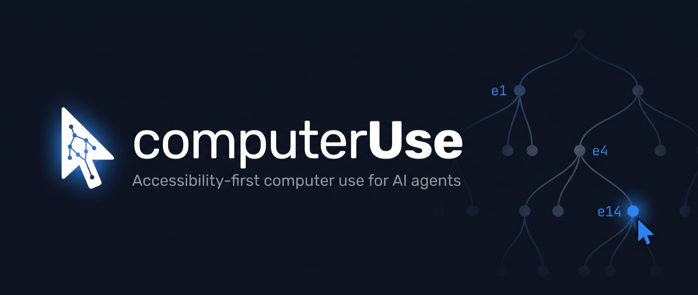
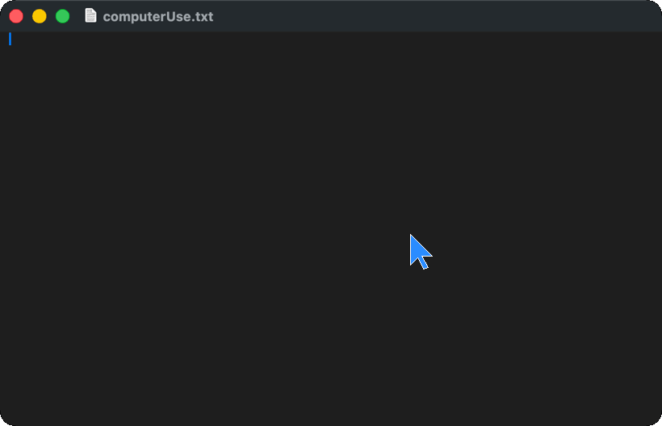
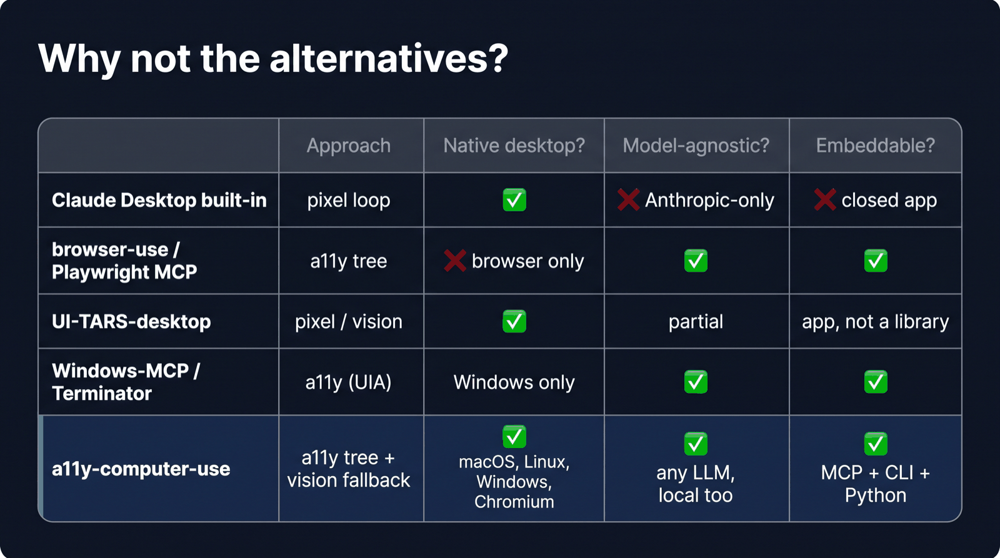
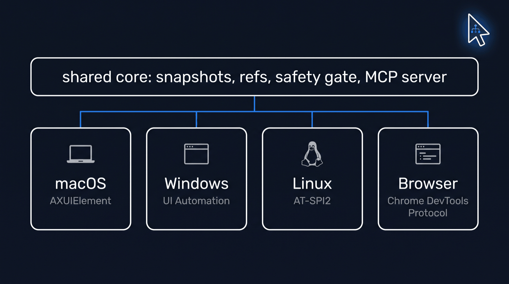
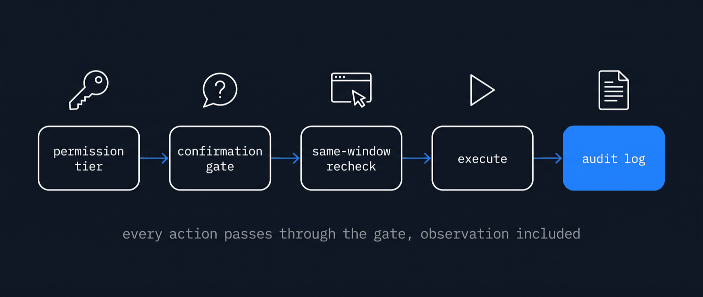
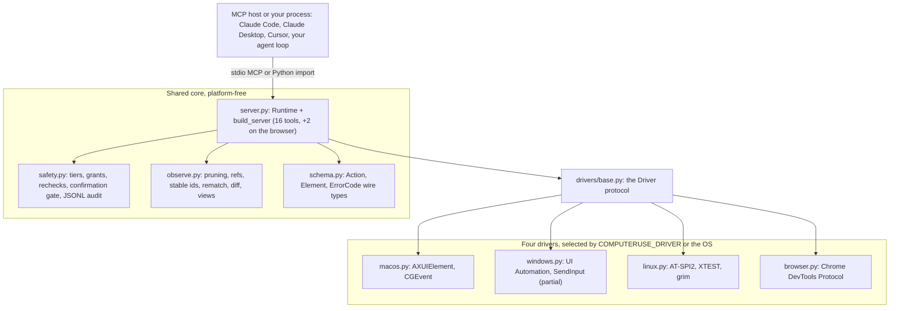
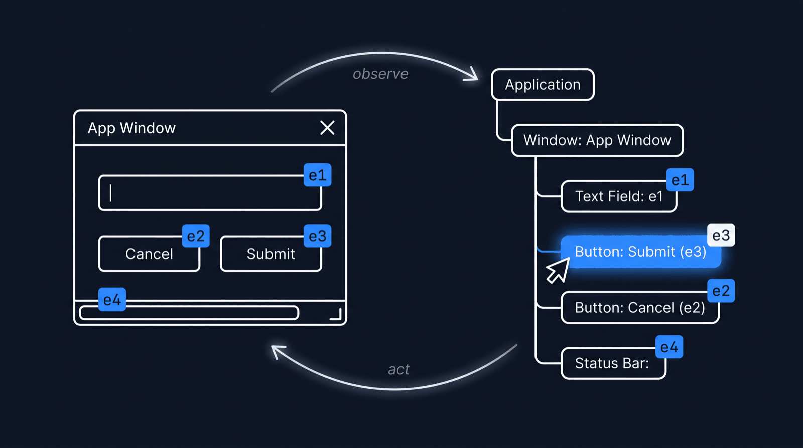
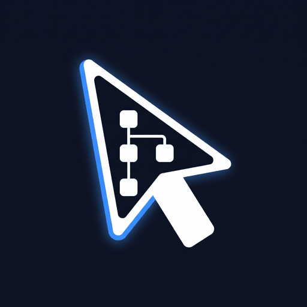

<p align="center">
  
</p>

<p align="center">
  <a href="https://github.com/Perception-Dynamics-Inc/computerUse/actions/workflows/ci.yml"></a>
  <a href="./LICENSE"></a>
  
  
  
  <a href="https://github.com/Perception-Dynamics-Inc/computerUse/releases/tag/v0.1.0"></a>
</p>

<p align="center"><b>Accessibility-first computer use for AI agents. The model clicks <code>e14</code>, a real UI element, instead of a guessed pixel. macOS, Windows, Linux, and Chromium, one core.</b></p>

<p align="center">
  <a href="#quickstart">Quickstart</a> ·
  <a href="#connect-an-mcp-host">MCP hosts</a> ·
  <a href="#tool-surface">Tools</a> ·
  <a href="#why-computeruse">Why</a> ·
  <a href="#platform-support">Platforms</a> ·
  <a href="#embedding-computeruse">Embedding</a> ·
  <a href="#safety-model">Safety</a> ·
  <a href="#measured">Measured</a> ·
  <a href="#docs">Docs</a>
</p>



*A real capture. computerUse finds the text box as element ref `e3`, activates it through the accessibility API, and types. The glowing cursor is the standalone overlay module drawn for the demo; ref actions leave your real pointer alone.*

> **Status: v0.1.0**, installed from git, not yet on PyPI. Four `Driver` backends share one core. macOS is the most complete; Linux and the browser backend run live in CI and Linux was also verified on a real Ubuntu desktop; Windows is partial (observe, press, type, key chords). Every gate is listed under [Platform support](#platform-support).

## Quickstart

Python 3.11 or newer. Clone, install, and run the driver for your platform.

```bash
git clone https://github.com/Perception-Dynamics-Inc/computerUse.git && cd computerUse
python3 -m venv .venv && .venv/bin/pip install -e ".[dev]"      # or: uv venv && uv pip install -e ".[dev]"
```

**macOS**

```bash
.venv/bin/computeruse doctor                          # names the app that needs the Accessibility and Screen Recording grants
.venv/bin/computeruse snapshot --app TextEdit         # the pruned accessibility tree, one line per element, refs e1..eN
.venv/bin/computeruse snapshot --app TextEdit --mode interactive --budget 800
```

`doctor` prints System Settings deep links for the two one-time TCC grants. Relaunch the granting app afterwards.

**Linux (AT-SPI2)**

```bash
sudo apt install at-spi2-core gir1.2-atspi-2.0 gir1.2-gtk-3.0 python3-gi xclip
python3 -m venv --system-site-packages .venv && .venv/bin/pip install -e ".[dev]" python-xlib
.venv/bin/computeruse doctor && .venv/bin/computeruse mcp
```

Accessibility actions, typing, coordinate input, and capture are verified on X11. On native Wayland explicit accessibility actions such as `set_value` work and `grim` captures; implicit typing needs a verified frontmost app, while coordinate clicks and key chords return `unsupported` ([docs/linux-port.md](./docs/linux-port.md)).

**Windows (partial)**

```bash
pip install -e ".[dev,windows]" && computeruse mcp
```

Observe, press, type, and key chords are CI-verified against Notepad. Ref re-resolution, capture, and coordinate input still raise `NotImplementedError` ([docs/windows-port.md](./docs/windows-port.md)).

**Browser (Chromium over CDP)**

```bash
pip install -e ".[dev,browser]"
google-chrome --headless=new --remote-debugging-port=9222 about:blank &
COMPUTERUSE_DRIVER=browser COMPUTERUSE_CDP_ENDPOINT=http://127.0.0.1:9222 computeruse mcp
```

Tabs are the "apps". Never selected by OS; always opt in with `COMPUTERUSE_DRIVER=browser` ([docs/browser-backend.md](./docs/browser-backend.md)).

**Run an agent**

```bash
computeruse agent --provider claude-cli --grant full --task "Type hello in the Name field and press Submit"
```

The reference loop observes, plans, acts, and verifies through the same gated Runtime as the MCP server. Planners: `anthropic`, `openai` (any OpenAI-compatible endpoint, Ollama included), or `claude-cli`, which needs no API key ([docs/agent-loop.md](./docs/agent-loop.md)).

**Bench it**

```bash
computeruse bench web https://example.com --rounds 3     # accessibility snapshot vs screenshot, per observation
computeruse bench desktop --app Finder                   # the same for a running desktop app, every snapshot view
computeruse bench h2h --provider claude-cli              # same planner, refs vs pixels, 13 instrumented tasks
```

## Connect an MCP host

```bash
claude mcp add computeruse -- "$(pwd)/.venv/bin/computeruse" mcp
```

For hosts that read an `mcpServers` block (Claude Desktop, Cursor):

```json
{
  "mcpServers": {
    "computeruse": {
      "command": "/absolute/path/to/computerUse/.venv/bin/computeruse",
      "args": ["mcp"],
      "env": { "COMPUTERUSE_DRIVER": "browser", "COMPUTERUSE_CDP_ENDPOINT": "http://127.0.0.1:9222" }
    }
  }
}
```

Drop the `env` block for the OS driver. On macOS the host is the responsible process and must hold the Accessibility grant.

| Variable | Effect | Default |
|---|---|---|
| `COMPUTERUSE_DRIVER` | `macos`, `windows`, `linux`, or `browser` | current OS |
| `COMPUTERUSE_CDP_ENDPOINT` | DevTools endpoint for the browser driver | `http://127.0.0.1:9222` |
| `COMPUTERUSE_CONFIRM` | `0` disables the destructive-click confirmation gate | `1` |
| `COMPUTERUSE_AX_CLICKS` | `0` forces synthetic mouse events instead of accessibility press | `1` |
| `COMPUTERUSE_PROVIDER` | planner for `computeruse agent` and `bench h2h` | first one the environment supports |

The remaining variables are listed in [CONTRIBUTING.md](./CONTRIBUTING.md).

## Tool surface

16 tools on every driver, plus `console` and `network` on the browser. Every call, observation included, passes the same gate: permission tier, optional confirmation, same-window recheck, execute, audit.

| Tool | What it does | Tier |
|---|---|---|
| `desktop_snapshot(app, scope, mode, budget)` | Pruned accessibility tree with refs. `mode`: `full`, `interactive` (actionable elements only, same refs), or `diff` (what changed). `budget` caps the reply. | read |
| `find(app, text, role, editable, clickable)` | Fresh snapshot filtered to matching elements. | read |
| `screenshot(display_id, max_long_edge, marks)` | Downscaled capture; `marks=true` draws refs on it (Set-of-Mark). | read |
| `zoom(display_id, x, y, width, height)` | Native-resolution crop. | read |
| `click(ref \| x,y, button, count, modifiers, verify)` | Ref clicks press through the accessibility API and do not move the pointer. `verify=true` appends the post-click diff. | click |
| `type(text)` · `key(chord)` | Type into the focused element; one chord such as `cmd+s`. Both refuse secure fields. | full |
| `scroll(ref \| x,y, dx, dy, into_view)` · `drag(start, end)` | Wheel scroll or scroll-into-view; pointer drag. | click |
| `wait_for(ref, condition, timeout_s)` | Poll until `exists`, `actionable`, or `gone`. | read |
| `act(steps, verify)` | Batched steps, each gated at its own tier; stops at the first failure. | per step |
| `set_value(ref, value)` | Set an editable's value in one accessibility operation. | full |
| `scroll_to_find(app, text, role, ref)` | Scroll and re-observe until a match appears. | click |
| `app` · `window` · `clipboard` | list / launch / focus; list / raise; read / write. | read to full |
| `console(app)` · `network(app)` | Browser only: buffered console messages and request outcomes. | read |

Errors are wire-stable strings: `stale_ref` (with up to three candidates from the live tree), `secure_field`, `focus_changed`, `permission_denied_accessibility`, `permission_denied_screen`, `app_not_found`, `timeout`, `confirmation_declined`, `unsupported`, `busy`, `closed`.

## Why computerUse

Mainstream computer-use agents drive a machine the same way: screenshot, have the model regress an (x, y) pair, click, screenshot again. That needs a vision model on every step, aims at a number the model estimated rather than an object the OS already knows, moves the user's pointer, and leaves a trail of coordinates nobody can audit.

The browser world moved on years ago: [Playwright MCP](https://github.com/microsoft/playwright-mcp) hands the model the accessibility tree and lets it say `click e14`. computerUse does that for native desktop apps and for Chromium, with one core under four drivers.

```text
[snap-7] com.apple.TextEdit (window)
  e1 window "Untitled" [1024x768 @1:0,0]
    e2 textarea ="Hello" (edit,focus)
    e3 button "Save" (click)
```

Refs are snapshot-scoped. At act time they re-resolve against the live tree by stable id first, then role, title, path, and bounds. A miss returns `stale_ref` with the nearest candidates so the model corrects itself instead of clicking the wrong thing. Re-observing costs about 10 tokens as a diff.

This is not a token-savings pitch on the desktop: a pruned window snapshot of a rich native app costs about as much as one screenshot. The case is targeting, model choice, a pointer that stays yours, and an audit log that names the element.

### Why not the alternatives?

<p align="center"></p>

| | Approach | Native desktop? | Model-agnostic? | Embeddable? |
|---|---|---|---|---|
| **Claude Desktop built-in** | pixel loop | ✅ | ❌ Anthropic-only | ❌ closed app, not a library |
| **browser-use / Playwright MCP** | a11y tree | ❌ browser only | ✅ | ✅ |
| **UI-TARS-desktop** | pixel / vision | ✅ | partial | app, pivoted to an agent stack |
| **Windows-MCP / Terminator** | a11y (UIA) | Windows only | ✅ | ✅ |
| **computerUse** | **a11y tree (AX, UIA, AT-SPI2, CDP) with a vision fallback** | ✅ macOS, Linux, Windows (partial), Chromium | ✅ any LLM, local models included | ✅ MCP server, CLI, Python `Runtime`, adapters for Anthropic and OpenAI computer-use actions |

We deliberately do not build another browser agent (use Playwright MCP or browser-use), sandbox infrastructure (integrate E2B, cua, or Docker), or a foundation model. See [Non-goals](#non-goals).

## Platform support

<p align="center"></p>

✔ implemented and verified live · ◐ implemented, not live-verified or gated as noted · ✘ not implemented, or a structured `unsupported`

| Capability | macOS (AX) | Windows (UIA) | Linux (AT-SPI2) | Browser (CDP) |
|---|---|---|---|---|
| Snapshot, `find`, diff, interactive view | ✔ | ✔ CI, Notepad | ✔ CI, GTK3 | ✔ CI, iframes stitched |
| Ref press, `set_value` | ✔ | ◐ press live; no ref re-resolution yet | ✔ | ✔ |
| Type, key chords | ✔ | ✔ CI | ✔ real desktop and CI; implicit typing requires a verified frontmost app | ✔ |
| Coordinate click, drag, scroll | ✔ | ✘ | ✔ X11 (real desktop and CI under openbox); ✘ Wayland | ✔ |
| Screenshot, zoom | ✔ | ✘ | ◐ PIL on X11, `grim` on Wayland | ✔ |
| App, window, clipboard | ✔ | ✘ | ✔ real desktop | ◐ tabs as apps; clipboard `unsupported` |
| Secure fields refused | ✔ | ◐ UIA `IsPassword`, unit-tested | ◐ AT-SPI focus probe, unit-tested | ✔ |
| `console`, `network` | ✘ | ✘ | ✘ | ✔ |
| Permission model | Accessibility + Screen Recording | none | reachable a11y bus | reachable CDP endpoint |

- macOS live tests run only on a Mac that holds the grants; coordinate input, `wait_for`, `zoom`, `set_value`, chords, and clipboard there rest on the live smoke tests plus manual checks.
- Linux was verified on a real Ubuntu desktop (Budgie on Xorg), which found and fixed four bugs that Xvfb hid ([docs/box-testbed.md](./docs/box-testbed.md)). Wayland raw input (libei) is not implemented.
- Windows: `resolve_ref`, capture, coordinate input, app and window enumeration, and clipboard raise `NotImplementedError`, so ref clicks through the Runtime fail there today.
- Browser: same-process iframes are stitched into the snapshot; cross-origin ones are skipped. Per-job evidence is in [docs/ci.md](./docs/ci.md).

## Embedding computerUse

For concurrent workloads, use one Runtime and isolated target per worker. See the [production guide](./docs/production.md) for backpressure, cancellation, state retention and load validation, and the [concurrency contract](./docs/concurrency.md) for exact limits.

computerUse is infrastructure for agent products. Two shapes, and in both your app is the identity the OS trusts.

| | In-process | MCP subprocess |
|---|---|---|
| Shape | `import computeruse`, construct `server.Runtime()` | spawn `computeruse mcp`, speak MCP over stdio |
| Host language | Python 3.11+ | any |
| Identity | runs as your process | child of your process; TCC's responsible process is your signed app |
| Confirmation channel | a `confirm` callback | MCP elicitation, rendered by the host |
| Example | [`examples/inprocess_python.py`](./examples/inprocess_python.py) | [`examples/mcp_subprocess.mjs`](./examples/mcp_subprocess.mjs) |

```python
from computeruse import safety, server

store = safety.PermissionStore()                       # ~/.computeruse/permissions.json
store.set_tier("com.apple.TextEdit", safety.Tier.FULL)

runtime = server.Runtime(store=store)                  # audit log defaults to ~/.computeruse/audit/
print(runtime.desktop_snapshot("com.apple.TextEdit", mode="interactive"))
print(runtime.click(ref="e3", verify=True))            # accessibility press, then the post-click diff
```

```js
const transport = new StdioClientTransport({ command: "computeruse", args: ["mcp"] });
const client = new Client({ name: "my-ai-platform", version: "0.1.0" });
await client.connect(transport);
const snap = await client.callTool({ name: "desktop_snapshot", arguments: { app: "com.apple.finder" } });
```

Existing pixel-loop agents can adopt it without prompt changes: `computeruse.adapters` executes Anthropic (`computer_toolset_20260801` and older shapes) and OpenAI (`computer`) actions through the gated Runtime, and a plain left click on a known element becomes a ref press ([docs/provider-adapters.md](./docs/provider-adapters.md)).

Integrator checklist (macOS): sign with your own Developer ID (computerUse ships no certificate); request Accessibility, and Screen Recording only if you use the vision fallback; handle hardened-runtime library validation; make sure TCC's responsible process is your signed app. `computeruse doctor` prints which app that is.

## Observation engine

One engine in `computeruse/observe.py`; each driver only supplies the tree accessor and the native primitives.

- **Refs and epochs.** Refs are valid against their own snapshot. Targeting an older one returns `stale_ref` with up to three same-role candidates.
- **Stable ids.** `AXIdentifier`, `AutomationId`, `accessible-id`, or the backend DOM node id win outright; otherwise a title, path, and bounds ladder decides, and ties are reported as ambiguous rather than guessed.
- **Views.** `full`, `interactive` (actionable elements plus their containers, static text folded to one line each, same refs), and `diff`. `budget=N` truncates deterministically and says how many elements were omitted.
- **Effect Receipts.** `verify=true` on `click` and `act` re-snapshots and appends the diff, so the model sees what it changed without another call.
- **Set-of-Mark.** `screenshot(marks=true)` labels clickable and editable elements with their refs so a vision model can still answer `click e7`. Unit-tested with a fake driver; not live-verified.
- **Electron and Chromium.** Accessibility trees are force-enabled per process (`AXManualAccessibility` on macOS, `org.a11y.Status` on Linux); opt out with `COMPUTERUSE_NO_WEB_A11Y`.
- **Vision handoff.** A snapshot with zero interactive elements says so and points the model at `screenshot` plus coordinates. Telegram is the reference case.

## Safety model

<p align="center"></p>

| Tier | Allows | Tools |
|---|---|---|
| `read` | observe only | `desktop_snapshot`, `find`, `screenshot`, `zoom`, `wait_for`, `app list`, `window list`, `clipboard read`, `console`, `network` |
| `click` | read plus pointer actions | `click`, `scroll`, `drag`, `scroll_to_find`, `app launch`, `app focus`, `window raise` |
| `full` | everything | `type`, `key`, `set_value`, `clipboard write` |

- **Grants** live in `~/.computeruse/permissions.json`, keyed by bundle id, process name, or CDP tab id. An ungranted app is refused even for `read`. No tool can grant a tier; only a human edits the file, calls `PermissionStore.set_tier`, or passes `--grant` to `computeruse agent`.
- **Rechecks.** `type` and `key` compare the gated app to the frontmost app right before injecting; `click`, `scroll`, `drag`, and `set_value` hit-test the target point. A mismatch returns `focus_changed`.
- **Secure fields.** Password fields are never read, never typed into, never clicked by coordinate, and `set_value` refuses them, on every driver.
- **Confirmation gate.** A ref click whose label reads like an irreversible action (delete, move to trash, erase, wipe, don't save) asks the host through MCP elicitation. No channel means blocked, not fired. `COMPUTERUSE_CONFIRM=0` disables it ([docs/confirmation-gate.md](./docs/confirmation-gate.md)).
- **Audit log.** Always on, one JSONL file per UTC day in `~/.computeruse/audit/`: app, action, params, decision, result, duration, token estimate. Typed text is redacted when it hit a secure field or the clipboard; element values are always redacted. Pre-gate refusals (`stale_ref`, `secure_field`) are logged too. `computeruse bench audit` aggregates it.

Report safety bugs privately: [SECURITY.md](./SECURITY.md).

## Measured

| Surface | Result | Where |
|---|---|---|
| macOS desktop snapshots (Safari, Chrome, Calendar) | 680 to 1,460 tokens per pruned window, about one screenshot | [docs/phase-0-review.md](./docs/phase-0-review.md), July 2026 |
| Browser, real pages | example.com: 95 tokens full, 72 interactive, vs 473 to 876 for a screenshot. Hacker News: 4,539 full, 1,089 interactive, vs 2,072. Re-observe as a diff: 10 tokens on either page. | [docs/observation-cost.md](./docs/observation-cost.md) |
| Real 1080p Linux desktop | accessibility 176 tokens per observation vs 2,318 for a screenshot | [docs/box-testbed.md](./docs/box-testbed.md) |
| Head-to-head, same planner, 13 browser tasks | refs 13/13 done, 0 misclicks, $7.04; pixels 7/13, 27 misclicks, $11.74; pixels snapped to refs 6/13. About $0.54 vs $1.68 per completed task. Pixels won one task; the native `select` task is not comparable in headless Chrome. | [docs/benchmarks/h2h-2026-09-02.md](./docs/benchmarks/h2h-2026-09-02.md) |

One round, one planner (`claude-fable-5-1` through the Claude Code CLI), plain fixtures. The snapshot side grows with element count while a screenshot is fixed by viewport, so the ratio flips on dense pages; the diff advantage does not. Method: [docs/benchmark.md](./docs/benchmark.md).

Tests: 633 passed, 44 skipped locally on a Mac without the TCC grants. Five CI jobs, all green at `61b741d`: macOS (full suite), Windows (full suite plus live UIA), Linux (full suite plus live AT-SPI2 under a window manager), Browser (live CDP, adapters, agent loop, head-to-head), Package (uv build, uvx smoke). Details in [docs/ci.md](./docs/ci.md).

## Architecture



<p align="center"></p>

The model never touches the machine. It emits structured actions; the client executes them and feeds back what it observes: observe (`desktop_snapshot`, `find`, or a `diff`), decide (`click e14`), gate (tier, confirmation, recheck), execute (accessibility press, or synthetic input for coordinates), verify (Effect Receipt, `wait_for`, audit), repeat.

## Roadmap

**Done in 0.1.0.** Four drivers on one core; `find`, `act`, `set_value`, `scroll_to_find`, diff and interactive views, stable-id anchors, stale-ref candidates, Effect Receipts; reference agent loop; Anthropic and OpenAI executor adapters; head-to-head benchmark with a dated result; Linux real-desktop verification; secure-field refusals on every driver; full suite on every CI runner.

**Partial.** Windows (no ref re-resolution, capture, or coordinate input). Set-of-Mark screenshots (fake-driver tests only). The overlay cursor (standalone module, not wired into the server).

**Open.** Wayland raw input through libei or the RemoteDesktop portal. `window` move, resize, minimize. `act` batches with `set_value` steps. A separate grounder model for the vision path. Framework shims (LangChain, CrewAI, Vercel AI SDK). Teach and replay from the audit log. PyPI release and signed builds.

## Non-goals

- No screenshot-loop browser agent; the browser driver is coordinate-free on its ref path and adds `console` and `network`.
- No VM or sandbox infrastructure, no foundation model, no consumer `.app`, no signing certificate.
- IME and dead-key composition are out of scope for the per-character typing path.

## Docs

| Document | What it covers |
|---|---|
| [docs/README.md](./docs/README.md) | index of everything below, with each document's status and date |
| [docs/agent-loop.md](./docs/agent-loop.md) | the reference agent loop, its planners, the live `claude-cli` run |
| [docs/provider-adapters.md](./docs/provider-adapters.md) | executing Anthropic and OpenAI computer-use actions with snap-to-ref |
| [docs/observation-cost.md](./docs/observation-cost.md) | what a snapshot costs per view, measured, and which view to use |
| [docs/benchmark.md](./docs/benchmark.md) · [results](./docs/benchmarks/h2h-2026-09-02.md) | the head-to-head harness and the dated result |
| [docs/browser-backend.md](./docs/browser-backend.md) | the CDP driver, iframe stitching, tabs as apps |
| [docs/linux-port.md](./docs/linux-port.md) · [docs/box-testbed.md](./docs/box-testbed.md) | AT-SPI2 mapping, the Wayland matrix, the real-desktop run |
| [docs/windows-port.md](./docs/windows-port.md) | UIA mapping and what still raises |
| [docs/ci.md](./docs/ci.md) | what each CI job proves, live vs hermetic per platform |
| [docs/confirmation-gate.md](./docs/confirmation-gate.md) | why confirmation runs through MCP elicitation |
| [docs/demand-validation.md](./docs/demand-validation.md) · [docs/phase-0-review.md](./docs/phase-0-review.md) | the 30 sourced failure stories and the Phase 0 go decision |
| [PLAN.md](./PLAN.md) | the original thesis and architecture plan (July 2026) |
| [examples/](./examples/README.md) | in-process, MCP subprocess, agent loop, and adapter examples |

## Contributing, security, and license

[CONTRIBUTING.md](./CONTRIBUTING.md) covers setup per platform, the live-test gates, and the driver-seam rule. Vulnerabilities go through [SECURITY.md](./SECURITY.md), not public issues. Community standards: [CODE_OF_CONDUCT.md](./CODE_OF_CONDUCT.md). Changes: [CHANGELOG.md](./CHANGELOG.md).

Licensed under [Apache-2.0](./LICENSE) with a [NOTICE](./NOTICE) file.

<p align="center">
  <br>
  Copyright 2026 Perception Dynamics, Inc.
</p>
