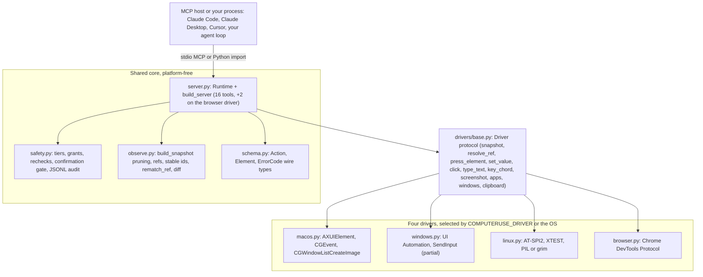

<p align="center">
  
</p>

<p align="center">
  <a href="https://github.com/Perception-Dynamics-Inc/computerUse/actions/workflows/ci.yml"></a>
  <a href="./LICENSE"></a>
  
  
  
</p>

<p align="center"><b>Accessibility-first computer use for AI agents: the model targets real UI elements by ref instead of guessed pixel coordinates, on macOS, Linux, and Chromium. Windows is partial: the model can snapshot by ref, type, and send key chords, but ref-targeted actions (<code>click</code>, <code>set_value</code>, <code>wait_for</code>, <code>act</code>) are not yet available through the server because <code>resolve_ref</code> is unimplemented.</b></p>

<p align="center">
  <a href="#quickstart">Quickstart</a> ·
  <a href="#connect-an-mcp-host">MCP hosts</a> ·
  <a href="#tool-surface">Tools</a> ·
  <a href="#why-computeruse">Why</a> ·
  <a href="#platform-support">Platforms</a> ·
  <a href="#embedding-computeruse">Embedding</a> ·
  <a href="#safety-model">Safety</a> ·
  <a href="#measured">Measured</a> ·
  <a href="#architecture">Architecture</a> ·
  <a href="#docs">Docs</a>
</p>


*A capture of a real run. computerUse finds the text box as a labelled element ref rather than a pixel it guessed, activates it through the accessibility API, and types. The glowing cursor is the standalone overlay module (`computeruse/overlay.py`), drawn for this demo; the MCP server does not draw it. Ref clicks, `set_value`, and scroll-into-view leave the physical pointer where it is, while wheel scrolls, drags, and raw x/y clicks are synthetic mouse events and do move it.*

> Status: v0.1.0, the first tagged release. Install from a clone; nothing is published on PyPI. Four `Driver` backends share one core. macOS is the most complete, and its live paths are verified only on a Mac that holds the Accessibility and Screen Recording grants. Linux runs live in CI under a window manager and was verified end to end on a real Ubuntu desktop VM. The browser backend runs live in CI. Windows is partial (observe, press, type, key chords). Five CI jobs cover macOS, Windows, Linux, the browser, and packaging. The exact gates are in [Platform support](#platform-support).

## Quickstart

Python 3.11 or newer. `mcp<2` and `pillow` install with the package; the pyobjc frameworks install only on macOS.

### macOS

```bash
git clone https://github.com/Perception-Dynamics-Inc/computerUse.git && cd computerUse
python3 -m venv .venv && .venv/bin/pip install -e ".[dev]"    # or: uv venv && uv pip install -e ".[dev]"

# 1. Check the two one-time TCC grants (Accessibility, Screen Recording).
#    doctor runs 6 checks, names the .app that owns the grants (Terminal, your
#    IDE, Claude Desktop), and prints System Settings deep links. Relaunch that
#    app after granting.
.venv/bin/computeruse doctor

# 2. Read a running app's pruned accessibility tree with refs. --app takes a bundle id
#    or display name (default: the frontmost app); --scope window|app; --mode full|interactive
#    (interactive keeps actionable elements only, same refs, fewer tokens); --budget TOKENS
#    caps the output; --bounds prints geometry on every line.
.venv/bin/computeruse snapshot --app TextEdit
.venv/bin/computeruse snapshot --app TextEdit --mode interactive --budget 800 --bounds

# 3. Grant TextEdit the full tier (the MCP session below uses the same grant),
#    then push one action through the gate from the CLI, with TextEdit open.
.venv/bin/python -c 'from computeruse import safety; safety.PermissionStore().set_tier("com.apple.TextEdit", safety.Tier.FULL)'
.venv/bin/computeruse run-once '{"tool": "app", "action": "focus", "name": "TextEdit"}'
```

`run-once` takes one JSON object with a `tool` key (`click`, `type`, `key`, `scroll`, `drag`, `app`, `window`, `clipboard`) and dispatches it through the same `Runtime` the MCP server uses. `app focus` gates against the resolved bundle id, so the grant above lets it through. `type` and `key` gate against the frontmost app, which is your terminal when you run them from a shell: without a grant for that bundle id they print `needs_permission: ...`, exit 1, and still write an audit entry under `~/.computeruse/audit/`. That is the safety layer working, not a crash. Refs are unavailable in `run-once` (a one-shot process has no snapshot), so `click`, `scroll`, and `drag` take x/y only. Exit code 2 means a usage or JSON error.

`computeruse doctor` exits 0 whenever it produces a report; failed checks are report content, not exit codes. `snapshot`, `run-once`, and `mcp` all resolve their backend through the driver seam, so `COMPUTERUSE_DRIVER` applies to each. `snapshot --mode` accepts `full` or `interactive`; `diff` exists only on the MCP tool and the Python `Runtime`.

### Linux (AT-SPI2)

```bash
sudo apt install at-spi2-core gir1.2-atspi-2.0 gir1.2-gtk-3.0 python3-gi xvfb dbus dbus-x11 xclip
git clone https://github.com/Perception-Dynamics-Inc/computerUse.git && cd computerUse
python3 -m venv --system-site-packages .venv      # reuse apt's python3-gi so pip never builds PyGObject
.venv/bin/pip install -e ".[dev]" python-xlib
.venv/bin/computeruse mcp
```

CI installs the same packages plus `openbox xdotool x11-utils` for its live step. The minimum is `at-spi2-core gir1.2-atspi-2.0`; `xclip` (or `xsel` or `wl-clipboard`) is for the clipboard tool, and `xvfb`, `dbus`, `dbus-x11` are for headless runs. `pip install -e ".[linux]"` is the alternative that pulls PyGObject and python-xlib from PyPI. The driver needs a reachable AT-SPI2 accessibility bus; if it is missing you get `permission_denied_accessibility` with an install hint, and `computeruse doctor` reports the display session, window manager, bindings, bus, XTEST, and clipboard tool. On X11 the whole input surface is verified live: coordinate clicks, drags, and wheel scrolls, key chords (including punctuation names and F13 to F24), XTEST typing including characters the keymap lacks, and the app, window, and clipboard tools, on a real Ubuntu desktop ([docs/box-testbed.md](./docs/box-testbed.md)) and in CI under the openbox window manager. On native Wayland (`WAYLAND_DISPLAY` set, `DISPLAY` unset) the AT-SPI path over D-Bus is what remains: snapshot, press, ref clicks that resolve to an AT-SPI action, `set_value`, and typing into a field the driver focused; capture uses `grim`. Those were checked by hand once under headless sway on 2026-08-29, and no test covers Wayland. Coordinate clicks, drags, wheel scrolls, key chords, and typing without a driver-focused field return `unsupported` there; libei and the RemoteDesktop portal are not implemented.

### Windows (partial)

```bash
pip install -e ".[dev,windows]"      # adds uiautomation
computeruse mcp
```

No permission dialog exists on Windows. In CI on `windows-latest` against Notepad, `desktop_snapshot` and `type` are proven through the gated Runtime; a11y press and key chords (`ctrl+a`) are proven at the driver level. `find` and `mode="diff"` run over the same snapshot path by code, not live-asserted. `set_value` (`ValuePattern`) and scroll-into-view (`ScrollItemPattern`) are implemented but not live-asserted. UIA password edits (`IsPassword`) are marked secure and never typed into, unit-tested only. `resolve_ref` (so ref-based `click`, `set_value`, `wait_for`, and `act` fail through the Runtime), coordinate `click`/`drag`/`scroll`, `wait_for`, `screenshot`/`zoom_region` (DXGI), and the driver's app, window-list, and clipboard queries still raise `NotImplementedError` naming their intended API; `window raise` returns a structured `unsupported`. Details in [docs/windows-port.md](./docs/windows-port.md).

### Browser (Chromium over CDP)

```bash
pip install -e ".[dev,browser]"      # adds websocket-client, the only extra dependency
google-chrome --headless=new --remote-debugging-port=9222 about:blank &
COMPUTERUSE_DRIVER=browser COMPUTERUSE_CDP_ENDPOINT=http://127.0.0.1:9222 computeruse mcp
```

The browser driver is never selected by OS; set `COMPUTERUSE_DRIVER=browser` or call `get_driver("browser")`. The driver binds the first `type == "page"` target from `{endpoint}/json`; pass `target_id` to `BrowserDriver` to bind another tab. Inside a container add `--no-sandbox --disable-gpu --disable-dev-shm-usage --no-first-run --no-default-browser-check` and wait for `/json/version` before starting, as CI does. No `--remote-allow-origins` flag is needed; the WebSocket handshake suppresses the Origin header. Tabs are the "apps": `app list` returns CDP page targets, `app focus` binds a tab, `app launch` takes a URL and navigates, and permission grants are keyed by the CDP target id. The subcommand is `mcp`; `computeruse serve` does not exist.

### Run an agent

```bash
# Planner: anthropic (ANTHROPIC_API_KEY), openai (OPENAI_API_KEY; OPENAI_BASE_URL for Ollama or vLLM),
# or claude-cli (the local `claude` command, no key). --grant writes the tier for the target app first.
computeruse agent --provider claude-cli --grant full --app TextEdit --task "Type hello into the document"

# The same loop on the browser backend, against the bound tab.
COMPUTERUSE_DRIVER=browser COMPUTERUSE_CDP_ENDPOINT=http://127.0.0.1:9222 \
  computeruse agent --provider claude-cli --grant full --task "Type hello in the Name field and press Submit"
```

The loop observes with `desktop_snapshot`, lets the planner act on refs, verifies with Effect Receipts, and stops when the model calls `done`. Every action goes through the same gated Runtime as the MCP server. Details and a recorded live run: [docs/agent-loop.md](./docs/agent-loop.md).

### Bench it

```bash
computeruse bench web https://example.com --rounds 3 --endpoint http://127.0.0.1:9222   # snapshot vs screenshot, per observation
computeruse bench desktop --app TextEdit --rounds 3        # every snapshot view of a running app vs one screenshot
computeruse bench h2h --provider claude-cli --rounds 1     # same planner: refs vs pixels vs pixels+snap on 13 browser tasks
computeruse bench audit                                    # aggregate ~/.computeruse/audit (cu-meter)
```

Numbers and method: [Measured](#measured).

## Connect an MCP host

The server speaks MCP over stdio. `computeruse mcp` takes no flags. The server name is `computeruse`, and its instructions tell the model to call `desktop_snapshot` first, prefer `mode="interactive"`, and act on refs.

```bash
# Claude Code, run from the repo root (the documented one-liner)
claude mcp add computeruse -- "$(pwd)/.venv/bin/computeruse" mcp
```

For hosts that read an `mcpServers` block (Claude Desktop, Cursor), the equivalent entry is below; the `env` block is only needed for the browser backend.

```json
{
  "mcpServers": {
    "computeruse": {
      "command": "/absolute/path/to/computerUse/.venv/bin/computeruse",
      "args": ["mcp"],
      "env": { "COMPUTERUSE_DRIVER": "browser", "COMPUTERUSE_CDP_ENDPOINT": "http://127.0.0.1:9222" }
    }
  }
}
```

The JSON shape mirrors the stdio launch that `examples/mcp_subprocess.mjs` and `tests/e2e/test_mcp_stdio.py` exercise; it has not been run against Claude Desktop or Cursor in this repo's CI. `python -m computeruse mcp` works too.

On macOS the host is the responsible process, so it must hold the Accessibility grant (and Screen Recording for capture). Hosts that support MCP elicitation get the destructive-click confirmation prompt; hosts that do not will see such clicks blocked with `confirmation_declined` unless `COMPUTERUSE_CONFIRM=0` is set in `env`.

Environment variables the server reads:

| Variable | Effect | Default | When read |
|---|---|---|---|
| `COMPUTERUSE_DRIVER` | Backend: `macos`, `windows`, `linux`, or `browser`. Any other value raises `NotImplementedError`. | current OS | `drivers.get_driver()` |
| `COMPUTERUSE_CDP_ENDPOINT` | HTTP DevTools endpoint for the browser backend. | `http://127.0.0.1:9222` | `BrowserDriver()` |
| `COMPUTERUSE_AX_CLICKS` | `0` forces synthetic mouse events instead of AX press and AX scroll-into-view. | `1` | import of `computeruse.server` |
| `COMPUTERUSE_CONFIRM` | `0` disables the destructive-click confirmation gate. | `1` | import of `computeruse.server` |
| `COMPUTERUSE_NO_WEB_A11Y` | Any value disables the automatic force-enable of Chromium/Electron accessibility trees. | unset | each snapshot on macOS; `ensure_trusted()` on Linux |
| `COMPUTERUSE_ATSPI_EVENTS` | Linux only. Any value routes libatspi calls through a dedicated GLib event thread with cached reads and wakes `wait_for` on AT-SPI events. | unset | every libatspi call, via `_atspi_events.enabled()` |
| `COMPUTERUSE_SCREEN` | Linux only. `WxH` fallback for the primary screen size when Xlib is unavailable. | `1280x800` | snapshot display geometry (`_atspi.primary_geometry`) |
| `COMPUTERUSE_OVERLAY_RGBA` | macOS only. `r,g,b` or `r,g,b,a` color for the demo overlay, 0..1 floats or 0..255 ints. | `0.16,0.55,1.0,1.0` | `overlay._resolve_rgba()` |

`COMPUTERUSE_AX_CLICKS` and `COMPUTERUSE_CONFIRM` are module constants, so set them in the host's `env` block before the server process starts.

The `computeruse agent` and `computeruse bench h2h` CLI subcommands (not the MCP server) additionally read `COMPUTERUSE_PROVIDER` (planner backend: `anthropic`, `openai`, or `claude-cli`; unset means the first one the environment supports), `ANTHROPIC_API_KEY` / `ANTHROPIC_AUTH_TOKEN` / `ANTHROPIC_BASE_URL`, and `OPENAI_API_KEY` / `OPENAI_BASE_URL` (`computeruse/providers.py`); see [docs/agent-loop.md](./docs/agent-loop.md).

## Tool surface

16 tools on every driver, plus `console` and `network` on the browser driver only (18 total there). The counts are what `build_server().list_tools()` returns, and `tests/test_server.py` asserts the list. Every tool, including observation, passes through the same gate: permission check, optional confirmation, same-window recheck, execute, audit.

| Tool | What it does | Tier | Gated against |
|---|---|---|---|
| `desktop_snapshot(app, scope="window", mode="full", budget=None, include_bounds=false)` | Pruned accessibility tree with refs `e1..eN`. `scope` is `window` or `app`. `mode` is `full` (the whole pruned tree), `interactive` (the same snapshot cut to actionable elements plus the windows, dialogs, toolbars, and titled groups that contain them, static text folded into one `text:` line per container; same refs, fewer tokens; the server instructions tell the model to prefer it), or `diff` (only changes since the previous snapshot of the same app, rendered in the view last asked for). `budget=N` caps the reply at about N tokens (4 chars each) and replaces the tail with a marker counting the omitted elements. `include_bounds=true` prints geometry on every line (default: roots only in full mode, none in interactive). | read | scoped app |
| `find(app, text, role, editable, clickable, scope="window")` | Fresh snapshot filtered to matching elements. At least one filter is required. | read | scoped app |
| `screenshot(display_id, max_long_edge=1280, marks=false)` | Downscaled display capture plus a text line with the scale. `marks=true` draws Set-of-Mark ref labels from the latest snapshot (unit-tested with a fake driver, not live-verified; see [Observation engine](#observation-engine)). | read | frontmost app |
| `zoom(display_id, x, y, width, height)` | Native-resolution crop of a display region. | read | frontmost app |
| `click(ref \| x,y, button="left", count=1, modifiers, verify=false)` | Ref (AX press, no cursor movement) or point. Refuses a secure element: a ref that resolves to one, or a point inside one in the latest snapshot. Destructive labels require confirmation. `verify=true` appends the post-click diff. | click | ref's app, else frontmost |
| `type(text)` | Types into the focused element. Refuses while a password field has focus, probed per driver: macOS secure input and the focused AX element, browser `document.activeElement`, Linux AT-SPI focus walk, Windows UIA `IsPassword`. | full | frontmost app |
| `key(chord)` | One chord such as `cmd+s`. | full | frontmost app |
| `scroll(ref \| x,y, dx, dy, unit="lines", into_view=false)` | Wheel scroll, or `into_view=true` to reveal a ref through the accessibility API. A wheel scroll over a secure element is refused. | click | ref's app, else frontmost |
| `drag(start_ref \| start_x,start_y, end_ref \| end_x,end_y)` | Pointer drag between two targets. Refused when either endpoint is a secure element. | click | start ref's app, else frontmost |
| `wait_for(ref, condition="exists", timeout_s=10)` | Poll until `exists`, `actionable`, or `gone`. Timeout clamps to 60 s. | read | ref's app |
| `act(steps, verify=false)` | Batched `click`/`type`/`key`/`scroll`/`drag`/`wait_for`, each gated at its own tier. Stops at the first failure, no rollback. | per step | per step |
| `set_value(ref, value)` | Sets an editable element's value in one accessibility operation; falls back to focus plus typing. Refuses secure fields, and the refusal is audited. | full | ref's app |
| `scroll_to_find(app, text, role, direction="down", max_scrolls=6, ref=None)` | Scroll the largest list, table, or scroll area below the window (or the container `ref` names) and re-observe until a text or role match appears. | click | scoped app |
| `app(action, name)` | `list` (read), `launch`, `focus`. `quit` raises `ValueError`. On the browser driver these operate on tabs and `launch` takes a URL. | read / click | resolved app id (`launch`: the identifier if not running) |
| `window(action, window_id)` | `list` (read) and `raise` (click), both through the driver: macOS activates the owner, Linux sets `_NET_ACTIVE_WINDOW`, browser and Windows return `unsupported`. `move`, `resize`, `minimize` raise `ValueError`. | read / click | window owner |
| `clipboard(action, text)` | `read` (read) and `write` (full). Browser: read returns empty, write returns `unsupported`. | read / full | frontmost app |
| `console(app)` (browser only) | Buffered console messages as `{level, text}`; reading clears the buffer. | read | scoped tab |
| `network(app)` (browser only) | Buffered requests as `{method, url, status}` or `{method, url, error}`; reading clears the buffer. | read | scoped tab |

Errors reach the client as strings of the form `<code>: <message> | detail: {...} | hint: ...`. The codes are wire-stable: `stale_ref`, `permission_denied_accessibility`, `permission_denied_screen`, `secure_field`, `focus_changed`, `app_not_found`, `timeout`, `confirmation_declined`, `unsupported`. The MCP layer always appends a `computeruse doctor` hint to the two `permission_denied_*` codes. Refusals render as `<verdict>: <reason>` with verdicts `needs_permission` and `deny`.

## Why computerUse

The mainstream desktop computer-use agents, and the provider computer-use tools they are built on, drive a machine the same way: take a screenshot, have the model regress an (x, y) pair, click it, take another screenshot. That loop has four costs baked into its shape. It needs a vision model on every step. The target is a number the model estimated rather than an object the operating system already knows about. The synthetic click moves the user's pointer and steals focus. And the trajectory it leaves behind is a list of coordinates, so nobody can say afterwards what was clicked.

The browser world took another path years ago. [Playwright MCP](https://github.com/microsoft/playwright-mcp) serializes the accessibility tree and lets the model say `click e14`. computerUse applies that idea to native desktop apps and to Chromium, with the same core code on all four backends.

### Refs, not pixels

`desktop_snapshot(app)` returns a pruned accessibility tree, one line per element, two-space indented by depth, with the `AX` role prefix stripped and flags comma-joined. The format, on an illustrative TextEdit window:

```text
[snap-7] com.apple.TextEdit (window)
  e1 window "Untitled" [1024x768 @1:0,0]
    e2 textarea ="Hello" (edit,focus)
    e3 button "Save" (click)
```

Refs are `e1..eN`, assigned in pre-order per snapshot, and they are snapshot-scoped. At act time the anchor is matched against a fresh live tree: an exact `stable_id` match first (`AXIdentifier` on macOS, `AutomationId` on Windows, `accessible-id` on Linux, the backend DOM node id in the browser), then a role, title, path and bounds ladder. When nothing resolves, the error is `stale_ref` and it carries up to three same-role `candidates` from the live tree, so the model can correct itself on the next call.

What that buys you, stated at the level the code supports today:

- The model targets a real element. `click(ref="e14")` re-resolves the ref against the live tree at act time. A failed resolve returns `stale_ref` with the nearest candidates instead of clicking the wrong place.
- Any model can read it. Snapshots are plain text, so a text-only or local model can consume them without a vision step; no run with such a model is recorded in this repo (the `computeruse agent` OpenAI-compatible planner accepts an Ollama `OPENAI_BASE_URL`, but that recipe was not run; see [docs/agent-loop.md](./docs/agent-loop.md) and [Roadmap](#roadmap)). Vision is a fallback path, not a requirement.
- Ref actions do not fight you for the mouse. On macOS a plain left click on a ref goes through `AXPress`, `set_value` sets `AXValue`, and `scroll(into_view=true)` uses `AXScrollToVisible`. Wheel scrolls, drags, and raw coordinate clicks still synthesize pointer events.
- Re-observation is cheap. `desktop_snapshot(mode="diff")` returns only what changed; an unchanged page costs about 10 tokens in the browser benchmark below.
- Every action is audited, refusals included. A JSONL log records the decision, the parameters (with secure-field and clipboard redaction), the result, and the duration. Refusals raised before the gate (`stale_ref` from ref resolution, `secure_field` from `set_value`) are logged with `decision: null`; invalid arguments (`ValueError`) are not. The `verify=true` re-snapshot is not audited on its own. See [Safety model](#safety-model).
- It embeds. Your app imports the library or spawns `computeruse mcp`; the OS permission grants attach to your signed app, and computerUse ships no certificate.

This is not a token-savings pitch on the desktop. A pruned window snapshot of a rich native macOS app costs about as much as one screenshot (see [Measured](#measured)). The case rests on targeting, model choice, non-intrusiveness, auditability, and cheap re-observation.

## Platform support

| Marker | Meaning |
|---|---|
| ✔ | implemented and verified live: in CI, on the Box desktop VM ([docs/box-testbed.md](./docs/box-testbed.md)), or on a Mac that holds the TCC grants |
| ✔* | implemented on macOS and checked by hand on a granted developer Mac; no automated live test |
| ◐ | implemented but not live-verified, or gated as noted |
| ✘ | not implemented, or a structured `unsupported` error |

| Capability | macOS (AX) | Windows (UIA) | Linux (AT-SPI2) | Browser (CDP) |
|---|---|---|---|---|
| Snapshot | ✔ TCC-gated | ✔ CI-live (Notepad) | ✔ CI-live (GTK3) and on a real desktop | ✔ CI-live; same-process (`srcdoc`) iframes stitched live; cross-origin iframes skipped (hermetic test only); 24-frame cap (untested) |
| `find`, diff | ✔ TCC-gated | ◐ same snapshot path; hermetic tests only | ◐ same snapshot path; hermetic tests only | ◐ `find` hermetic; the diff is measured live by cu-arena, `mode="diff"` through the Runtime is hermetic only |
| Ref re-resolution | ✔ | ✘ `NotImplementedError` | ✔ | ✔ stable id = backend DOM node id |
| Press a ref (accessibility) | ✔ `AXPress` | ◐ live only for the `SetFocus` branch on Notepad's edit control; `Invoke`/`Toggle`/`Select`/`Expand` implemented, not live-asserted; ref press through the Runtime fails until `resolve_ref` lands | ✔ CI-live | ✔ CI-live |
| `set_value` | ✔* `AXValue` | ◐ not live-asserted | ✔ live on the Box desktop (`EditableText`) | ✔ live in the head-to-head run |
| Type text | ✔ | ✔ CI-live | ✔ CI-live via `EditableText`; XTEST typing, including characters the keymap lacks, live under a real window manager (Box and CI) | ✔ CI-live |
| Key chord | ✔* | ✔ CI-live | ✔ live under a real window manager, including punctuation names and F13 to F24; ✘ native Wayland | ◐ hermetic tests only |
| Coordinate click, drag, scroll | ✔* TCC-gated | ✘ | ✔ X11, live under a real window manager (Box and CI); ✘ native Wayland | ✔ hermetic CDP tests; live in the head-to-head pixel loop |
| `wait_for` | ✔* TCC-gated | ✘ `NotImplementedError` | ◐ poll, not live-asserted; AT-SPI event wake with `COMPUTERUSE_ATSPI_EVENTS=1` | ◐ poll, not live-asserted |
| Screenshot and zoom | ✔ Screen Recording TCC; `zoom` ✔* | ✘ DXGI planned | ◐ PIL on X11, checked by hand on the Box desktop (1920x1080); `grim` on Wayland, no test | ✔ `Page.captureScreenshot` |
| App verbs and `window list` | ✔* | ✘ | ✔ live under a real window manager (Box and CI) | ◐ tabs as apps; hermetic tests only |
| `window raise` | ✔* | ✘ structured `unsupported` | ◐ EWMH `_NET_ACTIVE_WINDOW` by X window id, synthetic test only | ✘ structured `unsupported` (use `app focus`) |
| Clipboard | ✔* | ✘ | ✔ live under a real window manager, round-trip including non-ASCII | ✘ read returns empty, write `unsupported` |
| Secure fields | ✔ marked; press, `set_value`, pointer actions, and `type` refuse | ◐ UIA `IsPassword` marked; refusals unit-tested | ◐ marked; refusals unit-tested with a fake AT-SPI | ✔ marked; refusals verified live on 2026-09-02 |
| `console`, `network` | ✘ not registered | ✘ not registered | ✘ not registered | ✔ CI-live |
| Permission model | Accessibility + Screen Recording grants | none | reachable AT-SPI2 accessibility bus | reachable CDP endpoint |
| Grant key (app identity) | bundle id | process image name (`notepad.exe`) | process comm name (`gedit`) | CDP tab id |

Notes on the gates:

- macOS live paths need the TCC grants on the process that runs computerUse. Recent `macos-latest` CI images held both grants, so the granted-path tests ran there; the job prints its skip list with `pytest -rs` so you can tell which way it went. Automated live coverage on a granted Mac is narrow: a Finder AX walk, one ref click plus typing into TextEdit, one mouse move, a screenshot dimension check, the doctor probes, and one snapshot over MCP stdio. Coordinate input, `wait_for`, `zoom`, `set_value`, key chords, and the window and clipboard tools rest on manual checks on a granted developer Mac, hence the asterisks.
- Windows has no TCC analog: `ensure_trusted()` returns `None`, and input to a window at a higher integrity level (UIPI) is dropped silently by the OS. The `resolve_ref` gap means ref-based `click`, `set_value`, `wait_for`, and `act` fail through the Runtime today; the full list is in the [Windows quickstart](#windows-partial).
- Linux needs a reachable AT-SPI2 bus and has no per-app grant. The real-desktop verification (Budgie on Xorg, [docs/box-testbed.md](./docs/box-testbed.md)) found three coordinate-input bugs and one keyboard bug that Xvfb had hidden; all four are fixed, and the Linux CI job now runs under openbox so the same tests execute on every push. Wayland has one manual check (headless sway, 2026-08-29) and no test.
- The browser iframe stitcher grafts same-process frames (same-origin, `about:blank`, `srcdoc`) under their owner element. Cross-origin out-of-process frames are skipped without failing the snapshot; there is no live cross-origin test.
- Each backend is proven where it can run in a container: the browser driver against headless Chrome on `ubuntu-latest`, the Linux driver against a GTK3 window under Xvfb, openbox, D-Bus, and `at-spi-bus-launcher`, the Windows driver against Notepad on `windows-latest`.

## Embedding computerUse

computerUse is infrastructure for people building agent products. Two shapes, and in both your app is the identity the OS trusts.

| | In-process | MCP subprocess |
|---|---|---|
| Shape | `import computeruse`, construct `server.Runtime()` | spawn `computeruse mcp`, speak MCP over stdio |
| Host language | Python 3.11+ | any; Node shown below, the e2e suite drives it from Python |
| Identity | runs as your process | child of your process; TCC's responsible process is your signed app |
| Confirmation channel | you pass a `confirm` callback | MCP elicitation, rendered by the host |
| Example | `examples/inprocess_python.py` | `examples/mcp_subprocess.mjs` |

In-process (Python hosts):

```python
from computeruse import safety, server

store = safety.PermissionStore()                       # ~/.computeruse/permissions.json
store.set_tier("com.apple.TextEdit", safety.Tier.FULL)

runtime = server.Runtime(store=store)                  # audit log defaults to ~/.computeruse/audit/
print(runtime.desktop_snapshot("com.apple.TextEdit", scope="window"))
print(runtime.click(ref="e3", verify=True))            # AX press, then the post-click snapshot diff
print(runtime.type_text("hello"))
```

`Runtime(*, store=None, audit=None, driver=None)` defaults to `PermissionStore()`, `AuditLog()`, and `drivers.get_driver()`. Methods return `str`, except `screenshot` (text plus a `capture.ScaledImage`) and `zoom` (PNG bytes), and raise `ComputerUseError` or `ActionRefused`. With the confirmation gate on, a ref click on a destructive label is blocked with `confirmation_declined` unless you pass a `confirm` callback or set `COMPUTERUSE_CONFIRM=0`. `Runtime.call_tool(name, params)` reaches the full tool surface by name; `Runtime.dispatch` is the `run-once` subset.

Subprocess over MCP (any language; Node shown, from `examples/mcp_subprocess.mjs`):

```js
import { Client } from "@modelcontextprotocol/sdk/client/index.js";
import { StdioClientTransport } from "@modelcontextprotocol/sdk/client/stdio.js";

const transport = new StdioClientTransport({ command: "computeruse", args: ["mcp"] });
const client = new Client({ name: "my-ai-platform", version: "0.1.0" });
await client.connect(transport);

const snap = await client.callTool({
  name: "desktop_snapshot",
  arguments: { app: "com.apple.finder", scope: "window" },
});
console.log(snap.content[0].text);
```

The integrator's checklist (macOS; Windows and Linux notes live in `docs/windows-port.md` and `docs/linux-port.md`):

1. Sign your app with your own Developer ID on macOS, or an Authenticode certificate on Windows. computerUse ships no certificate and needs none.
2. Request the OS permissions your app uses: Accessibility always on macOS, Screen Recording only if you use the `screenshot`/`zoom` vision fallback. `computeruse doctor` runs 6 checks (`responsible_app`, `accessibility_grant`, `screen_recording_grant`, `python_version`, `pyobjc_version`, `mcp_import`), names the `.app` bundle in the parent chain that the grants attach to, and prints System Settings deep links.
3. Handle hardened-runtime library validation for notarization: embed in-process, sign the bundled components with your Team ID, or set `com.apple.security.cs.disable-library-validation`.
4. Subprocess model only: make sure TCC's responsible process resolves to your signed app (embed in-process, or ship the helper signed with your Team ID at a stable path). `doctor` prints the responsible app so you can check.

Your users grant permissions to your trusted app once, and the grants survive your updates because the identity is yours and stable.

## Observation engine

The engine in `computeruse/observe.py` is shared by all four drivers. Each driver supplies an accessor over its native tree; the engine does the pruning, indexing, and matching.

- Refs and epochs. Each snapshot gets an id `snap-N`. Refs are valid only against their own snapshot; the Runtime keeps one current epoch, replaced by `desktop_snapshot`, `find`, each step of `scroll_to_find`, and the `verify=true` re-snapshot. Targeting a ref from an older epoch returns `stale_ref` telling the model to re-observe. Live AX handles are retained for the last 8 epochs.
- Stable ids. When present, an exact (stable id, role) match is authoritative, so a button that changed both title and position still resolves.
- Re-resolution ladder. Without a stable id, candidates of the same role score 4 for a title match and 2 for a path match; partial matches must lie within 400 px; ties within 2 px are reported as ambiguous rather than guessed.
- Self-correcting `stale_ref`. The error detail carries `reason` (`not_found` or `ambiguous`), the anchor, and up to 3 `candidates` of the same role ranked by score and proximity.
- Interactive view. `mode="interactive"` keeps elements that are clickable or editable (disabled ones included), carry `checked`, `expanded`, `selected`, or `focused` state, or have a selectable role (rows, tabs, sliders, incrementors), plus the containers needed to tell them apart (roots, windows, sheets, dialogs, drawers, popovers, menus, menu bars, toolbars, tab groups, web areas, and any titled group). Everything else folds into one `text:` line per kept container (96 characters, 12 items, then `(+N)`). Refs are the snapshot's own refs, so `click`, `set_value`, `wait_for`, and `act` resolve them exactly as full-view refs. `budget=N` caps any view at about N tokens: the header always survives, lines are kept in order, and a trailing marker counts the omitted element lines. Measurements and guidance on which view to use are in [docs/observation-cost.md](./docs/observation-cost.md).
- Diff snapshots. `mode="diff"` renders a header `[new_id <- old_id] +A -R ~C` (the real header uses a left arrow glyph) followed by added, removed, and changed lines (value, title, enabled, focused, checked, selected, expanded, or moved bounds). Without a prior same-app snapshot it falls back to a plain render in the view last requested (`full` or `interactive`). Diffs and Effect Receipts render in the view the agent last asked for; in the interactive view static-text changes fold into one `~ text:` line and added or removed static elements are reported as counts.
- `find`. Case-insensitive substring on title or value, role match with the `AX` prefix ignored, and exact `editable`/`clickable` flags. Every match line carries bounds.
- `wait_for`. `exists`, `actionable` (enabled and clickable or editable), or `gone`, polled every 0.1 s at read tier, clamped to 60 s, returning `timeout` on expiry.
- `act` batch. Steps keyed by `do`, each gated and audited like its standalone tool. The batch stops at the first failure and reports `{i, do, ok, error}`; completed steps are not rolled back.
- `set_value`. One accessibility operation (`AXValue` on macOS, `ValuePattern` on Windows, `EditableText` on Linux, the native value setter plus `input`/`change` events in the browser), with focus-and-type as the fallback.
- `scroll_to_find`. Up to `max_scrolls` observe-scroll rounds against the largest list, table, or scroll area below the window (or the container `ref` names), 5 lines per step, returning the matches and the number of scrolls it took.
- Effect Receipts. `verify=true` on `click` and `act` re-snapshots the same app and scope after the action and appends the diff, so the model sees what its action changed without a second call. `type`, `key`, `scroll`, `drag`, and `set_value` do not take `verify`.
- Set-of-Mark screenshots. `screenshot(marks=true)` draws each clickable or editable element's ref from the latest snapshot onto the downscaled image, so a vision model can answer `click e7` and the accessibility path executes it (`computeruse/marks.py`). Unit-tested against a fake driver; not verified against a live display on any platform.
- Vision handoff. When a full snapshot finds zero interactive elements, the text ends with a note that the app is likely custom-drawn (Telegram is the reference case) and points the model at `screenshot` plus coordinates. It is a hint only; no screenshot is taken automatically.
- Chromium and Electron trees. On macOS the observer sets `AXManualAccessibility` and `AXEnhancedUserInterface` once per pid when it detects a web area; on Linux it flips `org.a11y.Status` over D-Bus. Both are on by default and disabled by `COMPUTERUSE_NO_WEB_A11Y`.
- Cursor-free actions. A plain left single click on a ref tries `press_element` first (`AXPress`, `AXConfirm`, `AXOpen`, `AXPick`, or `AXFocused` for editables) and falls back to synthetic mouse events only when that returns false. `COMPUTERUSE_AX_CLICKS=0` turns the preference off.
- Overlay. `computeruse/overlay.py` draws a click-through screen-edge glow and an agent cursor (white arrow, blue glow) on macOS. It is not wired into the server, the drivers, or the CLI; `python -m computeruse.overlay` runs an 8-second demo.

## Safety model

Every action, observation included, goes through `Runtime._run_gated`: `check_action`, then the confirmation gate, then a same-window recheck, then execution, then an audit write.

### Tiers and grants

| Tier | Allows | Tools at this tier |
|---|---|---|
| `read` | observe only, no input | `desktop_snapshot`, `find`, `screenshot`, `zoom`, `wait_for`, `app list`, `window list`, `clipboard read`, `console`, `network` |
| `click` | `read` plus pointer actions | `click`, `scroll`, `drag`, `scroll_to_find`, `app launch`, `app focus`, `window raise` |
| `full` | everything, including typing and keys | `type`, `key`, `set_value`, `clipboard write` |

Grants live in `~/.computeruse/permissions.json` (override with `PermissionStore(path)`):

```json
{"apps": {"com.apple.TextEdit": {"tier": "full"}}, "deny": [], "allow": []}
```

An app on `deny` is refused at every tier. A non-empty `allow` list is a whitelist. The store re-reads the file when its mtime or size changes, so a human can edit grants while a server is running. An app with no grant gets `needs_permission`, including for `read`: an ungranted app's snapshot or screenshot is refused rather than silently captured. No MCP tool grants a tier, so the model cannot grant itself access. The only grant paths are human-driven: edit the file, call `PermissionStore().set_tier`, or pass `--grant {read,click,full}` to `computeruse agent`, which calls `PermissionStore.set_tier` for the resolved target app before the run and persists it like any other grant (`computeruse/cli.py`).

### Which app an action is checked against

Ref-based actions (`click`, `scroll`, `drag`, `wait_for`, `set_value`) gate against the app of the snapshot that issued the ref. Coordinate clicks, `type`, `key`, `clipboard`, `screenshot`, and `zoom` gate against the frontmost app. `desktop_snapshot`, `find`, `console`, and `network` gate against the scoped app. `app focus` and `app launch` gate against the resolved app id (`launch` falls back to the raw identifier when the app is not running); `window raise` gates against the window's owner.

### Rechecks between decision and injection

- `type` and `key` compare the gated app to the frontmost app immediately before injecting and return `focus_changed` with `{"gated_app", "frontmost_app"}` in the detail if they differ.
- `click`, `scroll`, `drag`, and `set_value` hit-test the target point (on macOS, front-to-back over the on-screen window list) and return `focus_changed` with `{"gated_app", "app_at_point"}` if another app's window now covers it. If the owner cannot be determined the recheck degrades to a no-op.
- `wait_for`, the observation tools, the `app`/`window`/`clipboard` verbs, and the inner loop of `scroll_to_find` run no recheck.

### Secure fields

- `AXSecureTextField` elements (`<input type="password">` in the browser, `password text` on Linux, UIA `IsPassword` on Windows) are marked `secure`, and their value is never emitted.
- Every driver's `press_element` and `set_value` return false for a secure element, and the Runtime refuses pointer actions on one: a ref that resolves to a secure element, or a raw point inside one in the latest snapshot, for `click`, `drag` (either endpoint), and wheel `scroll`. The result is a structured `secure_field` error.
- `type` refuses while a password field has focus. macOS checks `IsSecureEventInputEnabled()` and the system-wide focused element; the browser evaluates `document.activeElement` through open shadow roots and same-origin iframes; Linux walks the active window for the focused node (bounded to 400 nodes); Windows asks UIA for the focused control's `IsPassword`. The browser probes were verified live on 2026-09-02; the Linux and Windows probes are unit-tested with fake modules. Key chords are not probed on any backend, and a password field that appeared after the last snapshot is unknown to the pointer check.

### Confirmation gate for irreversible clicks

- `safety.confirmation_prompt` fires only for a ref click whose element title contains one of `delete`, `move to trash`, `empty trash`, `trash`, `discard`, `erase`, `uninstall`, `permanently`, `wipe`, or `don't save` (either apostrophe form). Coordinate clicks, typing, keys, and `set_value` are never classified. The classifier is click-only and label-based. `send`, `remove`, and `reset` are deliberately not on the list.
- The `click` and `act` tools ask the host through MCP elicitation. Accept runs the click; anything else, including a host without elicitation, blocks with `confirmation_declined`. `COMPUTERUSE_CONFIRM=0` disables the gate. Details in `docs/confirmation-gate.md`.

### Audit log

Always on. One JSONL file per UTC day at `~/.computeruse/audit/YYYY-MM-DD.jsonl`; override the directory with `AuditLog(dir_path)`. Each entry has:

```text
ts        epoch float
app       the gated app id
action    lowercase action class name, for example click, typetext, observeop
params    the action's fields (enums as strings, nested targets as dicts)
decision  {verdict, app, required, granted, reason}
result    "ok", a verdict ("needs_permission", "deny"), or an ErrorCode value
metrics   {duration_ms, result_chars, tokens_est}    with tokens_est = (chars + 3) // 4
```

Redaction is fixed, not configurable. `text` and `chord` become `[REDACTED]` when the action hit a secure field or is any clipboard operation; element `value` fields inside targets are always redacted while role, title, path, and bounds stay. Non-secure typed text is kept for replay. Two refusals raised before the gate are logged too, with `decision: null`: a ref that fails to resolve (`stale_ref`, with the ref, the snapshot epoch, and the reason) and `set_value` on a secure field (`secure_field`, with the ref and role only). Input validation failures (bad modifiers, bad chord, missing target) raise `ValueError` before the gate and produce no audit entry. `computeruse bench audit [dir]` aggregates the log into per-action latency and token counts, plus planner token totals for `computeruse agent` runs.

## Measured

Four measurement sets exist. They cover different surfaces and are not interchangeable; each row names its provenance.

| Surface | What was measured | Result | Provenance |
|---|---|---|---|
| macOS desktop | Pruned window snapshots of rich native apps (Safari, Chrome, Calendar) in the full view | about 680 to 1,460 tokens per snapshot; Calendar month grid about 3,220; one screenshot about 1,100 to 1,600 tokens. Comparable to one screenshot, not 10x smaller. | Measured 2026-07-12, recorded in `docs/phase-0-review.md`. Not re-measured since; the `interactive` view did not exist then, and `bench desktop` needs the Accessibility and Screen Recording grants to add its number. |
| Browser test page (cu-arena, in CI) | The same page state captured both ways on headless Chromium: snapshot text vs a screenshot of the frame | 11-element page: 88 tokens per observation vs 454 for the screenshot (5.2x). Re-observing the unchanged page as a diff: 10 tokens. | Printed by the browser CI job on every run. Estimates: chars/4 for text, width x height / 750 for images. |
| Browser, real pages (cu-arena) | example.com and news.ycombinator.com in every view against one screenshot, after the prune depth fix | example.com: 95 tokens full, 72 interactive, vs 473 to 876 for the screenshot depending on frame size. Hacker News (435 elements): 4,539 full, 1,089 interactive, vs 2,072 for the screenshot; the full tree of a dense page costs more than the screenshot, the interactive view about half. Re-observe diff: 10 tokens on both. On a real 1920x1080 Linux desktop the same tool measured 176 tokens per snapshot vs 2,318 for the screenshot. | Run by hand on 2026-09-02 against headless Chrome 152 and on a Box desktop VM; commands in [docs/observation-cost.md](./docs/observation-cost.md) and [docs/box-testbed.md](./docs/box-testbed.md). |
| Head-to-head (cu-arena h2h) | The same planner solving 13 instrumented browser tasks three ways: on refs, on screenshot coordinates, and on coordinates snapped to refs | refs 13/13 done, 0 misclicks, $7.04 reported cost; pixels 7/13, 27 misclicks, $11.74; pixels+snap 6/13, 31 misclicks, $12.07. Per completed task about $0.54 vs $1.68. On the 12 comparable tasks: 12/12 vs 7/12 (the native `select` popup is not painted in headless Chrome, so that task is flagged for the pixel modes). Pixels beat refs on one task (`search_filter`, 5 turns vs 7). | One round, one planner (`claude-fable-5-1` through the Claude Code CLI), plain fixtures, headless Chrome 152, 2026-09-02. Every row and caveat: [docs/benchmarks/h2h-2026-09-02.md](./docs/benchmarks/h2h-2026-09-02.md); method: [docs/benchmark.md](./docs/benchmark.md). |

Read the browser rows carefully. The snapshot side grows with element count while the screenshot side is fixed by the viewport, so the ratio on a trivial page does not carry to a dense one; the interactive view and the diff are what keep dense pages cheap. The head-to-head is one round of one planner: the completion and misclick gaps are large, the cost gap comes mostly from fewer turns, and the harness found and fixed three of our own bugs on the way (an inverted browser wheel sign among them), which the result records.

Reproduce it:

```bash
computeruse bench web <url> --rounds 3 --endpoint http://127.0.0.1:9222   # snapshot vs screenshot per observation (full view)
computeruse bench web <url> --rounds 3 --mode interactive --json          # the interactive view, machine-readable
computeruse bench desktop --app <app> --rounds 3                          # every view of a running app vs one screenshot (macOS: both TCC grants)
COMPUTERUSE_DRIVER=browser computeruse bench desktop --rounds 3           # same, on the bound Chromium tab
computeruse bench h2h --provider claude-cli --rounds 1                    # the head-to-head; --list prints the suite, --render re-renders saved JSON
computeruse bench audit                                                   # aggregate ~/.computeruse/audit/*.jsonl: tokens_est, p50/p95 latency
```

Tests and CI. On a Mac without the TCC grants, `pytest -q -rs` reports 609 passed and 44 skipped; the skips are the platform-gated live tests and the display-gated macOS tests. Five CI jobs run on every push, all green at `b31f477` on 2026-09-02:

- macOS: the full suite. The TCC-gated tests run when the runner image holds the grants and skip otherwise; `-rs` prints which.
- Windows: the full suite, then live UI Automation against Notepad (snapshot, a11y press, SendInput typing, `ctrl+a`, the gated Runtime).
- Linux: the full suite, then the live AT-SPI2 and XTEST suites under Xvfb with the openbox window manager, so the real-desktop coordinate tests run on every push.
- Browser: the hermetic browser stack over a scripted CDP transport, then live observe, act, verify, iframes, console, network, cu-arena, the Anthropic adapter, the agent loop, the head-to-head harness, and `bench desktop` on headless Chrome.
- Package: `uv build`, a check that the sdist carries no brand media, `uvx --from <wheel> computeruse --help`, and a fresh-venv import of the wheel.

What each job proves, and what no job covers, is in [docs/ci.md](./docs/ci.md).

## Architecture



The pruning engine, ref re-resolution, diffing, the safety layer, and the MCP surface are written once. A driver supplies the tree accessor, the press/set/type/key primitives, capture, and system queries. The Windows and Linux CI jobs build the MCP server to prove the core imports without pyobjc.

### How the loop runs

<p align="center"></p>

The model never touches the machine. It emits structured actions; the client (this framework, inside your process) executes them and feeds back what it observes.

1. Observe: `desktop_snapshot(app)` returns a pruned tree with refs; `mode="interactive"` keeps only actionable elements, `find` narrows it, `mode="diff"` returns only what changed.
2. Decide: the model picks a tool call, for example `{"tool": "click", "ref": "e14"}`, or an `act` batch.
3. Gate: `check_action` looks up the app's tier, the confirmation classifier runs for destructive labels, and the same-window recheck runs right before injection.
4. Execute: the ref is re-resolved against the live tree (stable id first), then pressed through the accessibility API (`AXPress`, UIA Invoke, AT-SPI `do_action`, CDP `this.click()`); coordinate actions synthesize input events instead.
5. Verify and repeat: `verify=true` returns an Effect Receipt; `wait_for` blocks on `exists`, `actionable`, or `gone`; every attempt lands in the audit log.

The server's instructions tell the model to call `desktop_snapshot` first, prefer `mode='interactive'` and re-observe with `mode='diff'`, act on refs, re-observe on `stale_ref`, and run `computeruse doctor` on `permission_denied_*` (`_INSTRUCTIONS`, `computeruse/server.py`).

## Non-goals

- Not a screenshot-loop browser agent. The browser backend is a `Driver` behind the same core and MCP surface, coordinate-free on its ref path (coordinate click, drag, and scroll exist only as the vision fallback), with `console` and `network` as extra observations.
- No VM or sandbox infrastructure; integrate E2B, cua, or Docker.
- No foundation model.
- No eval-harness-in-CI product until users ask twice.
- No consumer `.app`, no signing certificate, no notarization on our side. The host app owns identity and permissions.
- IME and dead-key composition are out of scope for the per-character injection path.
- Games and anti-cheat on Windows are out of scope (synthetic input carries `LLHF_INJECTED`).

## Roadmap

Done:

- Phase 0 closed with a GO verdict on 2026-07-13: demand validation (30 sourced stories kept from 65 mined, kill criterion 20), hero workflow on Calendar via refs alone, per-app coverage table, confirmation gate, language decision (stay Python), name decision.
- macOS driver, pruning engine, vision-handoff note, MCP server plus CLI, safety v1 (tiers, JSONL audit, secure-field redaction, confirmation gate).
- Linux AT-SPI2 backend and browser CDP backend (with `console` and `network`), `find`, `act` batch, `set_value`, `scroll_to_find`, diff snapshots, stable-id anchors, stale-ref candidates, Effect Receipts, cu-meter, cu-arena.
- v0.1.0 (2026-09-02): the `interactive` snapshot view and `budget` cap; `bench desktop`; the reference agent loop (`computeruse agent`, live with the `claude-cli` planner); provider executor adapters for the Anthropic and OpenAI computer-use action shapes (live on the browser backend); the head-to-head harness with a dated result; the Linux backend verified on a real desktop VM, with three coordinate-input bugs and one keyboard bug fixed; secure-field refusals and audit rows on every driver; the full suite on every CI runner plus a package job.

Partial:

- Windows: observe, type, and key chords CI-verified against Notepad; a11y press CI-verified for the `SetFocus` branch only; `set_value` and scroll-into-view implemented but not live-asserted; UIA password fields marked secure (unit-tested); `resolve_ref`, coordinate input, `wait_for`, capture, and the app, window-list, and clipboard queries still raise `NotImplementedError`; `window raise` returns `unsupported`. Details in the [Windows quickstart](#windows-partial) and `docs/windows-port.md`.
- Set-of-Mark screenshots: implemented and unit-tested with a fake driver; no live-desktop test.
- Overlay: a standalone macOS module, not wired into the server.
- Provider adapters and the agent loop: live-verified on the browser backend and with the `claude-cli` planner; not run against the OS drivers, a real Anthropic or OpenAI endpoint, or the Ollama recipe.
- Head-to-head benchmark: one round of one planner on 13 plain browser fixtures; desktop apps not covered.

Open (no code yet):

- Wayland raw input through libei or the RemoteDesktop portal.
- `window` move, resize, and minimize; `app quit` (all raise `ValueError` today).
- `act` batch steps for `set_value` (a form fill costs the refs planner one extra turn per field today).
- A grounder model for the vision path; the planner side ships as the agent loop and can target a local model through `OPENAI_BASE_URL`, unrun so far.
- Framework shims (LangChain, CrewAI, Vercel AI SDK) and non-Python bindings.
- Teach and replay from audit logs (the log format is replay-compatible; nothing more exists).
- PyPI publishing and signed releases (v0.1.0 is a git tag).

## Docs

[docs/README.md](./docs/README.md) is the full index, with each document's own status and date, the examples, and the brand assets (including the social preview card to upload under Settings > Social preview). The short version:

| Document | What it covers |
|---|---|
| [PLAN.md](./PLAN.md) | thesis, architecture, tool surface design, roadmap phases, risks, anti-goals; a dated design record from 2026-07-02 that the Linux and browser backends postdate |
| [docs/browser-backend.md](./docs/browser-backend.md) | the CDP driver, its CDP mapping table, iframe stitching, tabs as apps, cu-arena |
| [docs/linux-port.md](./docs/linux-port.md) | AT-SPI2 primitive mapping, Linux-specific concerns, the Wayland support matrix, packaging |
| [docs/windows-port.md](./docs/windows-port.md) | UIA primitive mapping, what is implemented and what still raises `NotImplementedError`, Windows concerns |
| [docs/confirmation-gate.md](./docs/confirmation-gate.md) | the elicitation-based confirmation design (COM-10, 2026-07-12) and its limitations |
| [docs/phase-0-review.md](./docs/phase-0-review.md) | the Phase 0 go/no-go review (2026-07-13), per-app coverage, token footprint, TCC findings |
| [docs/demand-validation.md](./docs/demand-validation.md) | 30 sourced "I tried to automate my Mac and it failed" stories (each with a `source_url` in `docs/stories.json`), themes, and the kill criterion (2026-07-12) |
| [docs/stories.json](./docs/stories.json) | the same 30 stories as data (65 mined, 30 kept) |
| [docs/language-boundary.md](./docs/language-boundary.md) | why Phase 1 stays in Python (COM-11, 2026-07-13) |
| [docs/agent-loop.md](./docs/agent-loop.md) | the reference `computeruse agent --task` observe, plan, act, verify loop (`computeruse/agent.py`) and its planners (`computeruse/providers.py`); live on headless Chrome with the `claude-cli` provider (2026-09-02), real Anthropic/OpenAI endpoints and the Ollama recipe not run |
| [docs/provider-adapters.md](./docs/provider-adapters.md) | `computeruse.adapters`: executing Anthropic and OpenAI native computer-use actions through the gated `Runtime` with snap-to-ref; unit-tested, the Anthropic adapter live on the browser backend only |
| [docs/observation-cost.md](./docs/observation-cost.md) | what the snapshot token estimator counts, `computeruse bench` numbers measured 2026-09-02 against headless Chrome 152, and when to use `full`, `interactive`, `find`, or `diff` |
| [docs/benchmark.md](./docs/benchmark.md) | the `computeruse bench h2h` head-to-head harness: refs vs pixels vs pixels with snap-to-ref, the 13-task suite, the metrics, comparability flags, and what it does not measure |
| [docs/benchmarks/h2h-2026-09-02.md](./docs/benchmarks/h2h-2026-09-02.md) | the dated head-to-head result: 13 tasks, three modes, one planner, every row, the three harness-found bugs, and the caveats; JSON alongside |
| [docs/ci.md](./docs/ci.md) | the five CI jobs, what each proves, live vs hermetic per platform, how to reproduce each job locally, and the Box nightly |
| [docs/box-testbed.md](./docs/box-testbed.md) | the real-desktop Linux verification on a Box VM (Ubuntu 24.04, Budgie on Xorg, 2026-09-02): the whole suite and `doctor` 8 of 8 on the desktop, the pointer and keyboard round-trips, VS Code over AT-SPI, cu-arena on a 1080p display, and the four bugs Xvfb hid, all fixed; reproduction in `scripts/box/README.md` |
| [examples/README.md](./examples/README.md) | the two embedding shapes side by side, the agent-loop and adapter scripts, and the integrator checklist |

| [CHANGELOG.md](./CHANGELOG.md) | what landed, one line per non-merge commit; 0.1.0 is the first tagged release |
| [CITATION.cff](./CITATION.cff) | citation metadata for version 0.1.0 |

## Contributing, security, and license

- Contributing guidelines: [CONTRIBUTING.md](./CONTRIBUTING.md). Hermetic tests run on any OS; live tests self-skip without their platform, grant, or CDP endpoint.
- Security: report vulnerabilities as described in [SECURITY.md](./SECURITY.md) rather than in a public issue. This project injects input and reads UI trees, so treat grant-bypass, redaction, recheck, and confirmation-gate bugs as security reports.
- Community standards: [CODE_OF_CONDUCT.md](./CODE_OF_CONDUCT.md).
- Read [PLAN.md](./PLAN.md) before proposing scope changes; it holds the anti-goals.

Licensed under [Apache-2.0](./LICENSE) with a [NOTICE](./NOTICE) file. The explicit patent grant matters for software that injects input and reads accessibility trees.

<p align="center">
  <br>
  Copyright 2026 Perception Dynamics, Inc.<br>
  This product includes software developed at Perception Dynamics, Inc. Licensed under the Apache License, Version 2.0.
</p>
